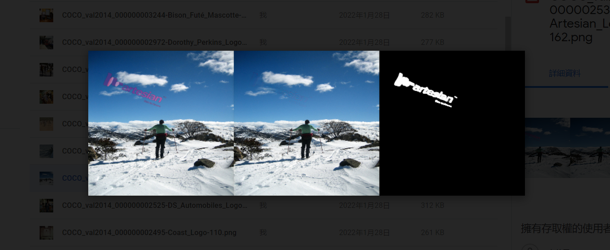
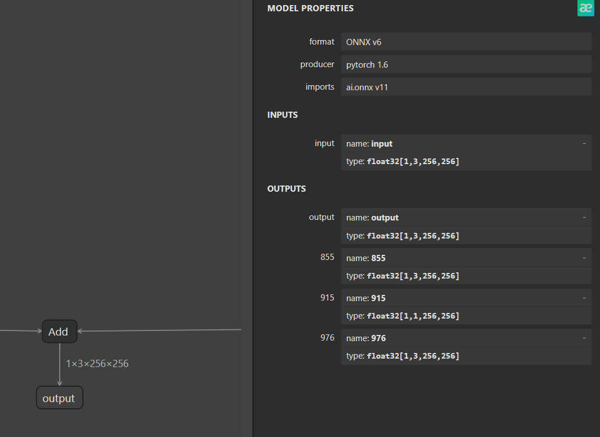
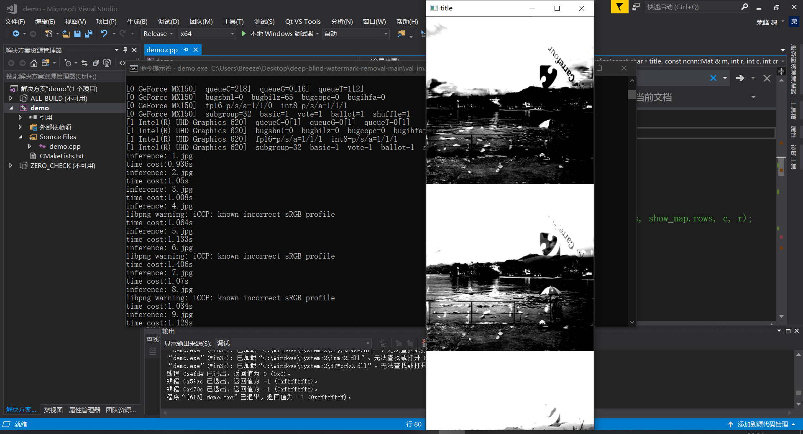
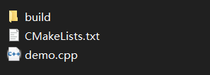
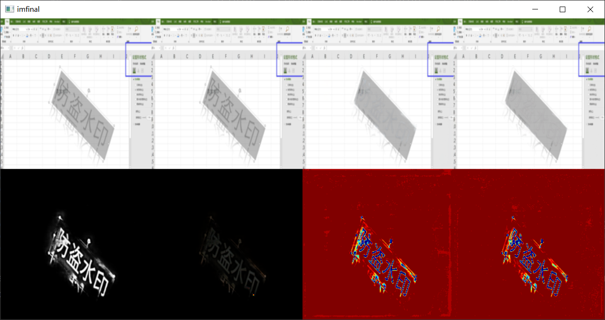
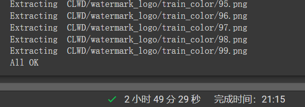

# Graduation Project Dai**ly**

**2022/2/3**

虎年吉祥！

正月初三，浅学了一下，才发现知云这么好用。。之前看下载页面好山寨啊，感觉下的是流氓软件一样，没想到翻译的还很不错！效率提高了不少

今天先读了slbr的第一遍，感觉和split then refine确实很像，可以好好研究一下

**2022/1/30**

计划过年这几天，其他先不做了吧，就翻译翻译论文，主要是SLBR和split then refine，感觉可能要初六再继续学了，算法开始看dp。

**2022/1/29**

昨天colab跑出来Self-calibrated Localization的代码，感觉效果还是很可以的

**2022/1/26**

这两天看剧看的有点多

距离春节最后四天，静下来好好学习一下

先睡吧，明天早上起来安排

**2022/1/24**

毕设出了点问题，没想到在转onnx的时候就有问题，白搞了这么久，debug了好久，好像onnx的输出就是原图？？大无语，可是ncnn那边的输出确实有水印消减的效果呀，也不知道怎么回事。打算换个代码试试了

唉挺烦的，跑个模型得花好久的时间。。

**2022/1/22**

距离出成绩还有一个月左右时间，

计划在过年前完成leetcode二叉树相关题目，dive into dl 5、7、8、9章节

**2022/1/21**

今天主要学了dive into dl

> 填充和步幅的计算
>
> 多输入通道和多输出通道
>
> 1x1卷积层
>
> 池化层

明天计划：

> :heavy_check_mark:1、dive into dl : LeNet, AlexNet（早上）
>
> :heavy_check_mark:2、leetcode
>
> 3、李宏毅

**2022/1/20**

区分卷积和互相关

**2022/1/19**

早上主要学习了pytorch的网络模型构建方法，明天可以开始卷积了！计划这周可以学完第五章！

做了一下午 + 一晚上的毕设，算是对网络模型有了进一步的了解

就是一直很奇怪不知道为什么c++那边输出的图像总是灰度的，也检查过是channel=3，不清楚哪里出了问题

总结一下今天的一些经验：

> :one:首先是模型输出上，可以先在netron上显示一下onnx的网络，onnx的网络还是很规整的，找到output，这里就有blob的名称：output、855、915、976，然后对应到ncnn的param里面search一下，一般都会有在
>
> 
>
> :two:注意在多个模型输出的时候，**可以多次使用extract，但是注意输出blob的次序要按网络先后顺序！**如上图，应当是 855->915->976
>
> :three:模型结构文件参考[param and model file structure · Tencent/ncnn Wiki (github.com)](https://github.com/Tencent/ncnn/wiki/param-and-model-file-structure)
>
> [layer type] [layer name] [input count] [output count] [input blobs] [output blobs] [layer specific params]，**注意要extract的是blob name 而不是layer name**
>
> :four:CV_8UC1，CV_8UC2，CV_8UC3。
> （最后的1、2、3表示通道数，譬如RGB3通道就用CV_8UC3）
>
> 而float 是32位的，对应Cv::Mat数据结构参数就是：CV_32FC1，CV_32FC2，CV_32FC3...
> double是64bits，对应Cv::Mat数据结构参数：CV_64FC1，CV_64FC2，CV_64FC3等。

计划明天：好像只有早上有时间了

> dive into dl 第五章先看看吧！（早上）

**2022/1/18**

dive into dl 终于可以进入第四章了！真的很拖拉！

计划明天：

> :heavy_check_mark:1、dive into dl 第四章可以看完（早上）
>
> :heavy_check_mark:2、毕设

**2022/1/15**

每日画大饼时间到!

今天只有晚上学了一小会儿，做完datawhal的任务，明天多花点时间在dive into dl上面吧

单词不要紧，leetcode更重要一些！

> 1、dive into dl **第三章**
>
> 2、leetcode

**2022/1/14**

有点来晚了，今天早上push网络不大行，玩了一个下午一个晚上hhh

明天还要去奶奶家，害，计划一下明天：

> :heavy_check_mark:1、datawhale完成task4(早上)
>
> :heavy_multiplication_x:2、dive into dl  **第三章**
>
> :heavy_multiplication_x:3、可以开始雅思单词了
>
> :heavy_multiplication_x:4、leetcode

**2022/1/13**

早上下午都学了一会儿，早上真的困，要调整一下作息了，下午感觉还行，明天再更吧，看了一个晚上的绝命毒师hhhh

回顾一下本周ddl：

> datawhale可以按时完成
>
> dive into dl 第四章可能有压力
>
> 毕设有两三天没看了
>
> 算法方面，可以开始刷二叉树的题目了
>
> > 明天估计只有上午、半个晚上的时间​​
> >
> > 预计完成 :heavy_check_mark:1、datawhale笔记整理
> >
> > ​				:heavy_check_mark:2、背单词
> >
> > ​				:heavy_multiplication_x:3、算法刷题 *2

**2022/1/12**

是没有学习的一天.下午和朋友们去爬山,晚上吃火锅,小日子很悠闲,走了很远的路,只是太阳晒得不够一些

**2022/1/9**

这两天主要学了线性回归和逻辑回归的实现,代码是能看懂,但是自己写确实写不出来...

好久没有复习单词了,遗忘得很快,这几天要花点时间捡起来

明天开始datawhale有任务了,哎好多事情要做

给自己一个ddl吧:

> :one:datawhale:  耗时两周(固定时间)----完成时距离春节还有一周
>
> :two:dive into dl:  本周完成第三 四章内容----完成时距离春节还有两周
>
> :three:毕设:  让ncnn得到我想要的输出
>
> :four:算法:  学完第一章

**2022/1/7**

今天主要学习了dive into deep learning的前两章,虽然之前有看过一遍,但是真的几乎都忘了!

笔记附上(见dive into dl 文件夹)

打算下学期出去实习,先冲冲看,顺便学一些知识也有利于复试

**2022/1/6**

到家了！

感觉自己有好多基础编程知识没有掌握，之前总是用到哪学到哪，没有系统的学习，现在遗忘了好多，今天没啥进展，接下来打算好好补一下numpy、opencv还有pytorch。

**2022/1/5**:

~~计划明天先部署着看，之前ncnn有的步骤有点忘了~~

先快速打个卡，幸好还有一点印象，大概今天能有这样网络输出吧，还没有得到最终结果，应该还有一些后处理代码要写，至少证明这个模型能转，后面就能放心开始读论文读代码了！

今天早点回去整理行李，明天要回家咯:happy:

------

想想还是赶紧记录一下今天实验过程吧 怕等等又忘了：

> --》部署必备三件套：  准备好 CmakeLists.txt  推理模型用的 c++代码  还有一个空的 build 文件夹（编译产生的都将放在里面） 
>
> > 
> >
> > 今天使用成功的 cmake 编译指令 ：
> >
> > `cmake -G "Visual Studio 15 2017 Win64" -Dncnn_DIR=C:/Users/Breeze/ncnn/build-vs2017/install/lib/cmake/ncnn -DOpenCV_DIR=C:\\"Program Files"\\opencv\\build\\x64\\vc15\\lib ..`
> >
> > ~~注意：不能用vs 的x64命令行，今天用的这个也卡了好一会儿，后面用vs打开sln的时候他说~~
> >
> > 好像想想问题是之前输入`-G "Visual Studio 15 2017 Win64" `的时候Win64在引号外面...
> >
> > > 打开sln后一般来说(今天)opencv会自动配上了，但是ncnn和vulkan要另外加：
> > >
> > > 在**C/C++的附加目录**以及**VC++目录**加上：
> > >
> > > ​	C:\VulkanSDK\1.2.162.0\Include
> > >
> > > ​	C:\Users\Breeze\ncnn\build-vs2017\install\include\ncnn
> > >
> > > 在**链接器-输入的附加依赖项**加上：
> > >
> > > ​	C:\Users\Breeze\ncnn\build-vs2017\install\lib\ncnn.lib
> > > ​	C:\Program Files\opencv\build\x64\vc15\lib\opencv_world349.lib
> > > ​	C:\VulkanSDK\1.2.162.0\Lib\vulkan-1.lib
> > > ​	C:\Users\Breeze\ncnn\build-vs2017\install\lib\glslang.lib
> > > ​	C:\Users\Breeze\ncnn\build-vs2017\install\lib\SPIRV.lib
> > > ​	C:\Users\Breeze\ncnn\build-vs2017\install\lib\MachineIndependent.lib
> > > ​	C:\Users\Breeze\ncnn\build-vs2017\install\lib\OGLCompiler.lib
> > > ​	C:\Users\Breeze\ncnn\build-vs2017\install\lib\OSDependent.lib
> > > ​	C:\Users\Breeze\ncnn\build-vs2017\install\lib\GenericCodeGen.lib
> > > ​	kernel32.lib
> > > ​	user32.lib
> > > ​	gdi32.lib
> > > ​	winspool.lib
> > > ​	shell32.lib
> > > ​	ole32.lib
> > > ​	oleaut32.lib
> > > ​	uuid.lib
> > > ​	comdlg32.lib
> > > ​	advapi32.lib
>
> 然后可以把ALL-BUILD和ZERO-CHECK项目卸载，后面就可以快乐编译了！

**2022/1/4**:

> 玩了好多天了
>
> 前几天一直push不上去，加上国内网络不好，今天才知道要另外加令牌。。
>
> 前两天终于在pc端跑出来一个(split then refine)
>
> 
>
> > 
>
> 目标:bookmark_tabs:
>
> > 项目清单（paper+code）
> >
> > [GitHub - bcmi/Awesome-Visible-Watermark-Removal](https://github.com/bcmi/Awesome-Visible-Watermark-Removal)
> >
> > 打卡：
> >
> > :white_circle:[amirhertz/visual_motif_removal (github.com)](https://github.com/amirhertz/visual_motif_removal)
> >
> > :ok: [AAAI 2021\] Split then Refine: Stacked Attention-guided ResUNets for Blind Single Image Visible Watermark Removal](https://github.com/vinthony/deep-blind-watermark-removal)
> >
> > :white_circle:[MRUIL/WDNet (github.com)](https://github.com/MRUIL/WDNet)
> >
> > :white_circle: [ACM MM 2021\] Visible Watermark Removal via Self-calibrated Localization and Background Refinement (github.com)](https://github.com/bcmi/SLBR-Visible-Watermark-Removal)
>
> 解压了快三个小时也是绝了 
>
> 
>
> 明天不打算训练，colab太搞人了不知道为什么原本解压好好的现在数据有一部分丢失了，之前也是这样。
>
> 

**2021/12/30**:

> 看到昨天的日志，仿佛我还满怀期待的准备和她出去玩，可是该走的总是要走，一个月来的回忆要多久能淡去。没有人能真的很好规划未来，但还是希望晴天早点到来，也至少是个慰藉

今天真的不大想工作

**2021/12/29**:

> 瞎说:yum:
>
> > 开门放鞭炮:fireworks:(并不认同这个emoji是鞭炮)
> >
> > 前天商量的结果是，准备做图像水印去除或者是继续上次服创项目的改进，有可能还能顺手报个比赛，但是去年服创参与感就是觉得好黑，辛亏还有区域奖不然真就白给
>
> 
>
> 这几天打算先探探底，看看哪些项目能做哪些不能做，别等等毕设没做出来或是很拉跨就挺尴尬。**在选题截止之前（2022-1-5）把水印去除的几种方法都试一试，最好确保一下部署的可行性**，总的方向还是想用ncnn，希望nihui姐姐保佑！
>
> 
>
> 展望:runner:
>
> > 如果能顺利整完一个方法的部署，就基本可以确定就做水印去除了，其实对这个项目还是很有兴趣的，也对他的前景抱有很大的信心，考研一路过来，经常被各种水印阻碍到哈哈哈哈哈盗版资料（bushi），虽然说水印的发明本质就是为了更好的保障作者合法权益和著作权，但是毕竟矛盾是同一性和斗争性的统一，只有相互促进了才能更好的发展嘛hhhhhh（tao）
>
> 目标:bookmark_tabs:
>
> > 项目清单（paper+code）
> >
> > [GitHub - bcmi/Awesome-Visible-Watermark-Removal](https://github.com/bcmi/Awesome-Visible-Watermark-Removal)
> >
> > 打卡：
> >
> > :white_circle:[amirhertz/visual_motif_removal (github.com)](https://github.com/amirhertz/visual_motif_removal)
> >
> > :white_circle: [AAAI 2021\] Split then Refine: Stacked Attention-guided ResUNets for Blind Single Image Visible Watermark Removal](https://github.com/vinthony/deep-blind-watermark-removal)
> >
> > :white_circle:[MRUIL/WDNet (github.com)](https://github.com/MRUIL/WDNet)
> >
> > :white_circle: [ACM MM 2021\] Visible Watermark Removal via Self-calibrated Localization and Background Refinement (github.com)](https://github.com/bcmi/SLBR-Visible-Watermark-Removal)

split then refine ：很方便可以在colab运行，本地运行有报错尚未解决​​

Visable Watermark Removal via Self-calibrated Localization and Background：没有pretrained-model，准备在colab上先训练看看

