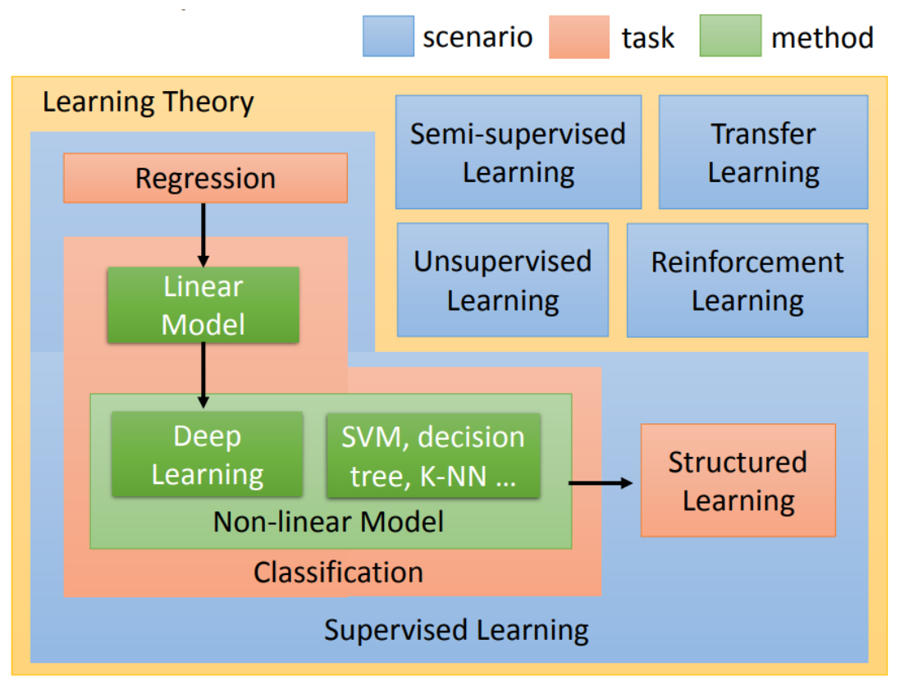

# 李宏毅《机器学习》

### Task1

蓝色的方块，指的是学习的**情景(scenario)**，通常学习的情景是你没有办法控制的。(比如，因为我们没有data做监督学习，所以我们才做reinforcement learning)

> 根据情景划分,可以分为监督学习,无监督学习,半监督学习,强化学习,迁移学习

红色的是指你的**task**，你要解的问题，你要解的这个问题随着你用的函数的不同，有regression、有classification、有structured。在不同的情境下，都有可能要解这个task。

最后，在这些不同task里面有不同的**model**，用绿色的方块表示。

以上一张图可以很好的囊括整个机器学习中的主要内容,并且对一些名词从质上做了划分

> **注意这个关系: 因为我们没有data做监督学习，所以我们才做reinforcement learning, 强化学习本身是属于"情景"范畴的划分。**
>
> 然而现在因为Alpha Go比较火，所以Alpha Go中用到的reinforcement learning会被认为比较潮。所以说有学生去面试，说明自己是做监督学习的，就会被质疑为什么不做reinforcement learning。那这个时候你就应该和他说，如果我今天可以监督学习，其实就不应该做reinforcement learning。reinforcement learning就是我们没有办法做监督学习的时候，我们才做reinforcement learning。