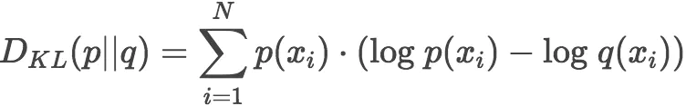
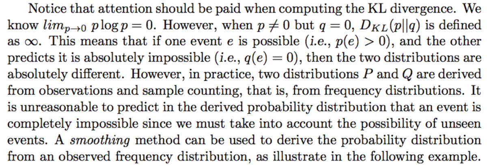
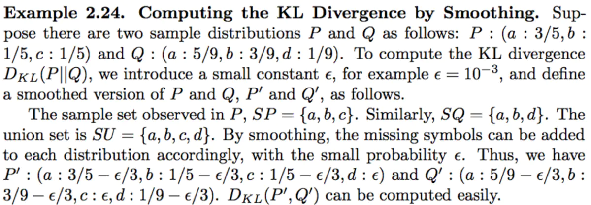
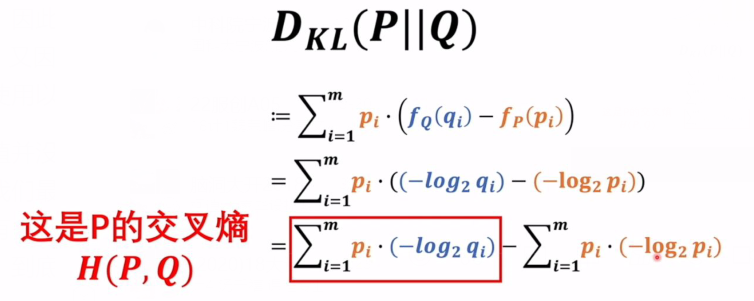

# Cross Entropy Loss

[TOC]

[参考：[如何理解K-L散度（相对熵） - 简书 (jianshu.com)](https://www.jianshu.com/p/43318a3dc715?isappinstalled=0)]

## 熵


H(X)表示熵，可以理解为确定性的增加，对于一个系统内的所有事件xi，信息量f(x1, x2) = f(x1) * f(x2)，将连乘改为连加，因此这里用log，由于概率越小的事件带来的信息量应该越大(中国队赢球带来的信息量就很大)，所以乘上系数-1，又因为系统内发生概率小的事件应当占有较小的权重，因此取加权平均求期望，得到上是H(X)的定义。如果我们使用以`2`为底的对数计算H值的话，可以把这个值看作是编码信息所需要的最少二进制位个数bits

可是熵值并没有给出压缩数据到最小熵值的方法，即如何编码数据才能达到最优（存储空间最优）。熵的主要作用是告诉我们最优编码信息方案的理论下界（存储空间），以及度量数据的信息量的一种方式。但是理解了熵，我们就知道有多少信息蕴含在数据之中，现在我们就可以计算当我们用一个带参数的概率分布来近似替代原始数据分布的时候，到底损失了多少信息。

## KL散度



K-L散度其实是数据的**原始分布p**和**近似分布q**之间的对数差值的期望，用于评估**近似分布**相对于**原始分布**的**损失的期望**。如果继续用`2`为底的对数计算，则**K-L散度值表示信息损失的二进制位数**



> 计算KL散度时需要注意：虽然当p(xi)->0时，p(xi)log(p(xi)) = 0，但是q(xi) = 0时，p(xi)log(q(xi)) -> 无穷大，也就是说在观测q(xi)时应注意，每个事件的观测概率基于统计样本，有可能q(xi)=0，但实际上并不是绝对0，所以应当采取一些smooth 策略



> 以上图片说明了Smoothing的实现，其实就是加上一个很小的正数eps，挺常见的



> 根据吉布斯不等式，若
>
> ，且，则有：
>
> 
>
> 等号成立当且仅当
>
> 因此必由DKL大于0
>
> 而DKL后面一项pi(log(pi))是个常数，因此前项可以单独作为损失函数——交叉熵

## 交叉熵

交叉熵是信息论中的一个重要概念，它的大小表示两个概率分布之间的差异，可以通过最小化交叉熵来得到目标概率分布的近似分布。


其中p是真实值，q是预测值

## Binary Cross Entropy（BCE）


> 由于输入xi(即pi)是真实值，只有true or false两种结果，而输出的yi表示的是一个概率，因此当xi == 1时，对应yi，xi == 0时，对应1 - yi，得到上式，即为**binary cross entropy**
>
> ```python
> bce_loss = nn.BCELoss(reduction='mean')
> loss0 = bce_loss(guess, real)
> # 要求guess和real的shape完全相同，与nn.CrossEntropyLoss()有所不同，因为bce只有两类，详见下文
> ```

**其中p表示真实值，在这个公式中是one-hot形式(只有0、1)；q是预测值，在这里假设已经是经过`softmax`后的结果了（在区间(0, 1)上）。**

## Cross Entropy 实现

仔细观察可以知道，因为p的元素不是0就是1，而且又是乘法，所以很自然地我们如果知道1所对应的index，那么就不用做其他无意义的运算了。所以在`pytorch`代码中target不是以one-hot形式表示的，而是直接用scalar表示。所以交叉熵的公式(**m表示真实类别**)可变形为：


**其实就是先求预测q的`softmax`得到`qm`，再取log得到 `-logqm`，其中第m个就是cross entropy loss(因为除了第m项其他都是0)**

即相当于`F.cross_entropy `自动调用`log_softmax`和`nll_loss`来计算交叉熵，计算方式如下：


其中`nllloss`全称为negative log likelihood loss，`nllloss`对两个向量的操作为，**将predict中的向量，在class中对应的index取出，并取负号输出。label中为1，则取2，3，1中的第1位3，取负号后输出**。

`nll_loss`表达式为：(把index的数取出来再加一个负号)

> 
>
> 
>
> 1.  predict shape为（1, category）的情况
>
> ```python
> # 
> predict = torch.Tensor([[2, 3, 1]])
> label = torch.tensor([1])
> nllloss(predict, label)
> # output: tensor(-3.)
> ```
>
> `nllloss`对两个向量的操作为，**将predict中的向量，在label中对应的index取出，并取负号输出。label中为1，则取2，3，1中的第1位3，取负号后输出**。
>
> 2. predict shape为（n, category）的情况
>
> ```python
> predict = torch.Tensor([[2, 3, 1],
>                         [3, 7, 9]])
> label = torch.tensor([1, 2])
> nllloss(predict, label)
> # output: tensor(-6)
> ```
>
> **`nllloss`**对两个向量的操作为，继续**将predict中的向量，在label中对应的index取出，并取负号输出。label中为1，则取2，3，1中的第1位3，label第二位为2，则取出3，7，9的第2位9，将两数取平均后加负号后输出**。
>
> 这时就可以看到最开始的`nllloss`初始化的时候，如果参数reduction取'mean'，就是上述结果。如果reduction取'sum'，那么各行取出对应的结果，就是取sum后输出，如下所示：
>
> ```python
> nllloss = nn.NLLLoss( reduction='sum')
> predict = torch.Tensor([[2, 3, 1],
>                         [3, 7, 9]])
> label = torch.tensor([1, 2])
> nllloss(predict, label)
> # output: tensor(-12)
> ```


`cross entropy loss`

```python
class torch.nn.CrossEntropyLoss(input， target， weight=None, size_average=None, ignore_index=-100, reduce=None, reduction='mean', label_smoothing=0.0)
```

该函数计算了input和target之间的交叉熵

**input** tensor：(minibatch, C, d1, d2, ... , dk) ->images时k=2

**target** tensor：(minibatch, d1, d2, ... , dk) ->images时k=2

> target 会进行one-hot编码（编码后其数值不是0就是1），变成与input形状相同
>
> 自动调用softmax将input的数值归一化

```python
>>>input
tensor([[[[0.0857, 0.6313, 0.1061],
          [0.7650, 0.8302, 0.0626],
          [0.6615, 0.0109, 0.3815]],
		 [[0.2607, 0.1581, 0.1963],
      	  [0.0504, 0.4804, 0.1693],
      	  [0.2520, 0.1406, 0.4154]]]])
>>> target
tensor([[[1, 1, 0],
         [0, 1, 1],
         [0, 0, 0]]])
'''
target中元素种类数(2种)必须和input中第二维矩阵个数相等(类别数C)
每个像素的交叉熵损失的数学计算过程如下：以第一个像素为例，该像素的真实标签是1，即target[0][0][0]；该像素预测标签为0的概率为0.0857，即input[0][0][0][0]，预测标签为1的概率为0.2607，即input[0][1][0][0];
计算过程中，真实标签target要采用one-hot形式，与input可以一一对应
'''
```

**target中<font color='blue'>元素种类数(2种)</font>必须和input中<font color='blue'>第二维矩阵个数(类别数C)</font>相等**

## Balance Cross Entropy

可选参数**weight**应当是一个一维的张量，表示每个类别的权重，这在你训练数据集样本不均衡时十分有用——**balance cross entropy**

输入张量input应当是每个类对应的原生的、**未经过归一化**的概率

如果指定了**ignore_index**，那么即使这个索引不在class range的范围内，loss也会接收这个索引的类

**注意：当在target中指定类索引时性能会更好；只有当每个minibatch对应一个类标签的限制情况下才考虑将target设置成类概率**

size_average(已弃用)