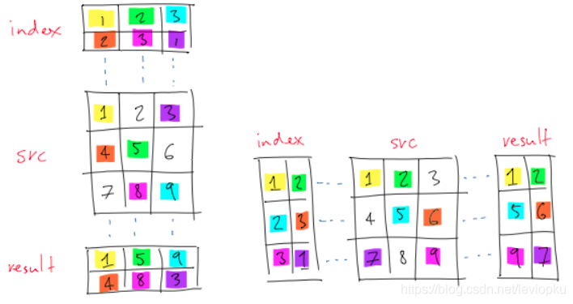

## Softmax

对于离散的分类模型,输出值的范围难以确定,难以衡量误差,因此采用softmax将输出值变换成值为正	且和为1的概率分布:


线性回归中采用的平方损失函数在逻辑回归中过于严格,我们并不需要预测概率完全等于标签概率,因	此应采用更适合衡量两个概率分布差异的测量函数----交叉熵(cross entropy)


​	交叉熵只关心对正确类别的预测概率,只要其值足够大,就可以保证分类结果正确

假设训练数据集的样本数为n,交叉熵损失函数定义为


如果样本只有一个标签,那么交叉熵损失可以简写成


​	即最小化交叉熵损失函数等价于**最大化**训练数据集所有标签类别的联合预测概率。


## 手动实现Softmax

注意：**输入X（n*d）矩阵的行数n表示样本数量——number，d表示特征数——dimension**，下图中**q**表示**输出个数**。

:star:

​		已知每个样本输入是高和宽均为28像素的图像。模型的输入向量的长度是 28×28=784.该向量的每个元素对应图像中每个像素。由于图像有10个类别，单层神经网络输出层的输出个数为10，因此softmax回归的权重和偏差参数分别为784×10和1×10的矩阵。

#### 1、softmax函数

```python
def softmax(X):
    X_exp = X.exp()
    partition = X_exp.sum(dim=1, keepdim=True)
    return X_exp / partition  # 这里应用了广播机制
```

dim = **0/1**表示加和变成只有**一行/一列**

可以只对其中同一列（`dim=0，全部加成一行`）或同一行（`dim=1，全部加成一列`）的元素求和，并在结果中保留行和列这两个维度（`keepdim=True`）。

为了表达样本预测各个输出的概率，softmax运算会先通过`exp`函数对每个元素做指数运算，再对`exp`矩阵**同行元素求和**，最后令矩阵每行各元素与该行元素之和相除。这样一来，最终得到的矩阵每行元素和为1且非负。因此，该矩阵**每行都是合法的概率分布**。softmax运算的输出矩阵中的任意一行元素代表了一个样本在各个输出类别上的预测概率。

#### 2、cross_entropy函数

由于mnist的标签只有“是”或“不是”，即1或0，因此：

```python
def cross_entropy(y_hat, y):
    return - torch.log(y_hat.gather(1, y.view(-1, 1)))# 不用再乘上y
```

:star:**变量`y_hat`是2个样本在3个类别的预测概率，变量`y`是这2个样本的标签类别**，则通过使用`gather`函数，可以得到2个样本的标签的**预测概率**，由此取log得到cross entropy。

对gather(dim,index)函数的解释如下图，左边是dim=0，右边是dim=1；dim=0表示index用来取代dim所在维度（行）的索引，另一个维度的索引从0开始递增。如下左：黄色->1，表示行号为1，列号为1，对应（1，1）为1；绿色->2，表示行号为2，列号为2（递增上来的），对应（2，2）为5。且有`result.shape == index.shape`，技巧是，**dim=0时，如下图左，把index放在src上方，列列相对应，index中每个元素表示行号，然后直接在src中读数即可**




#### 3、accuracy函数

给定一个类别的预测概率分布`y_hat`，我们把预测概率最大的类别作为输出类别

```python
def evaluate_accuracy(data_iter, net):
    acc_sum, n = 0.0, 0
    for X, y in data_iter:
        acc_sum += (net(X).argmax(dim=1) == y).float().sum().item()
        n += y.shape[0]
    return acc_sum / n
```

其中`y_hat.argmax(dim=1)`返回矩阵`y_hat`每行中最大元素的索引（返回结果是一列），且返回结果与变量`y`形状相同。**相等条件判断式`(y_hat.argmax(dim=1) == y)`是一个类型为`ByteTensor`的`Tensor`**，我们用`float()`将其转换为值为0（相等为假）或1（相等为真）的浮点型`Tensor`。