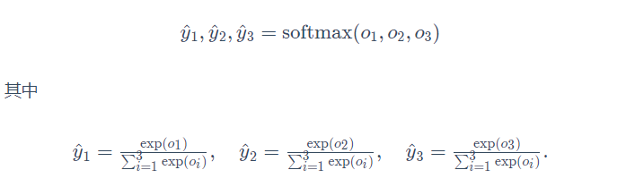
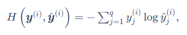
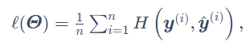
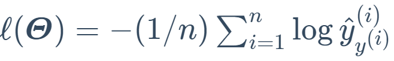
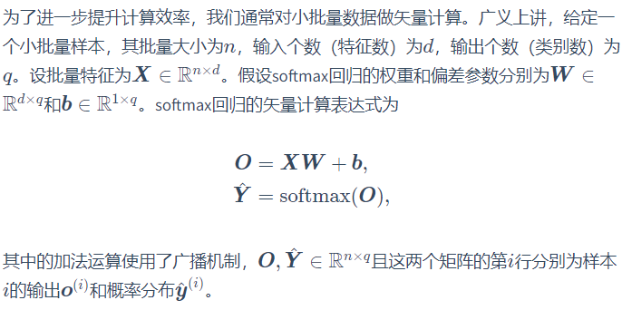

## Softmax

对于离散的分类模型,输出值的范围难以确定,难以衡量误差,因此采用softmax将输出值变换成值为正	且和为1的概率分布:

线性回归中采用的平方损失函数在逻辑回归中过于严格,我们并不需要预测概率完全等于标签概率,因	此应采用更适合衡量两个概率分布差异的测量函数----交叉熵(cross entropy)

​	交叉熵只关心对正确类别的预测概率,只要其值足够大,就可以保证分类结果正确

假设训练数据集的样本数为n,交叉熵损失函数定义为

如果样本只有一个标签,那么交叉熵损失可以简写成

​	即最小化交叉熵损失函数等价于最大化训练数据集所有标签类别的联合预测概率。

## 手动实现Softmax

:star:

​		已知每个样本输入是高和宽均为28像素的图像。模型的输入向量的长度是 28×28=784.该向量的每个元素对应图像中每个像素。由于图像有10个类别，单层神经网络输出层的输出个数为10，因此softmax回归的权重和偏差参数分别为784×10和1×10的矩阵。