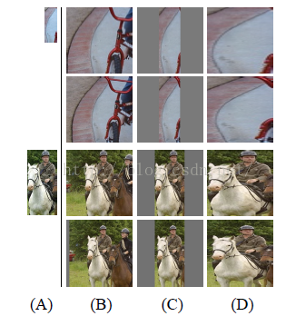
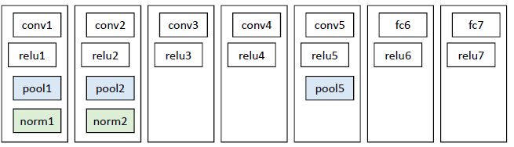
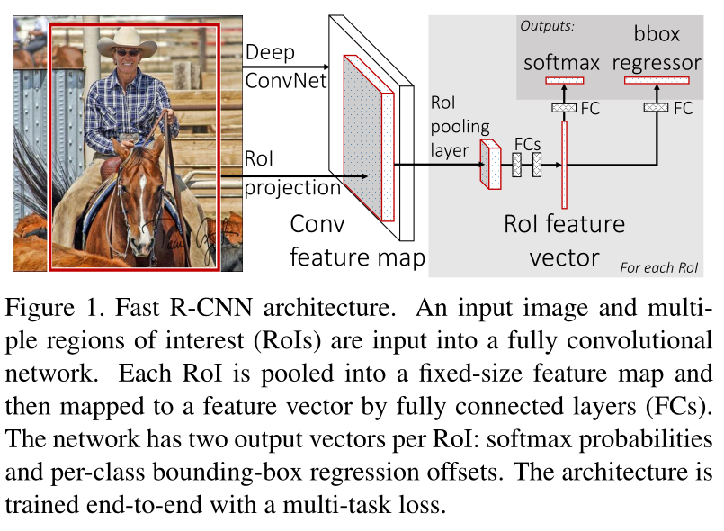
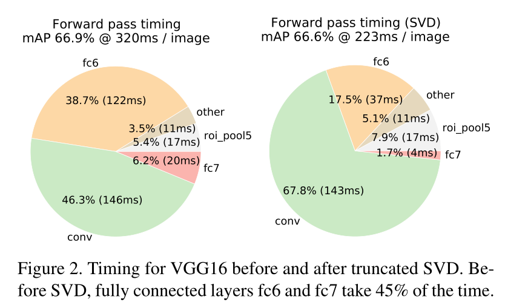
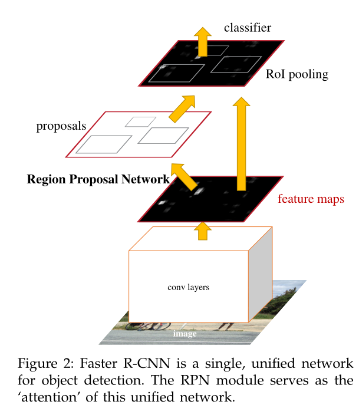

# R-CNN

（没有直接读论文）

| paper reading standard | tutorial | pass 1 | pass 2 | pass 3 |
| ---------------------- | -------- | ------ | ------ | ------ |
| 1. all titles          | finished | √      | √      | √      |
| 2. abstract            | finished | √      | √      | √      |
| 3. introduction        | finished |        | √      | √      |
| 4. method              | finished | graph  |        | √      |
| 5. experience          | finished | graph  |        | √      |
| 6. conclusion          | finished | √      | √      | √      |

[TOC]

## 一、 介绍

Region-CNN，是最早、最有名的一类基于锚框和CNN的目标检测算法

经典的目标检测算法使用**滑动窗法**依次判断所有可能的区域。本文则预先提取一系列较可能是物体的**候选区域**，之后仅在这些候选区域上提取特征，进行判断。使用启发式搜索算法来选择锚框，每个锚框作为一个子图像

经典目标检测通过传统手工特征提取**SIFT、HOG**特征，RCNN首次使用**CNN**提取特征

## 二、 主要步骤

RCNN算法分为4个步骤

- 一张图像使用selective search算法生成1K~2K个**候选区域**
- 对每个候选区域，使用深度网络**提取特征**
- 特征送入每一类的SVM **分类器**，判别是否属于该类
- 使用回归器**精细修正**候选框位置

> 1. 输入一张多目标图像，采用selective search算法提取约2000个建议框；
>
> 2. 先在每个建议框周围加上16个像素值为建议框像素平均值的边框，再直接变形为227×227的大小；
>
> 3. 先将所有建议框像素减去该建议框像素平均值后【预处理操作】，再依次将每个227×227的建议框输入AlexNet CNN网络获取4096维的特征【比以前的人工经验特征低两个数量级】，2000个建议框的CNN特征组合成2000×4096维矩阵；
>
> 4. 将2000×4096维特征与20个SVM组成的权值矩阵4096×20相乘【20种分类，SVM是二分类器，则有20个SVM】，获得2000×20维矩阵表示每个建议框是某个物体类别的得分；
>
> 5. 分别对上述2000×20维矩阵中每一列即每一类进行非极大值抑制剔除重叠建议框，得到该列即该类中得分最高的一些建议框；
>
> 6. 分别用20个回归器对上述20个类别中剩余的建议框进行回归操作，最终得到每个类别的修正后的得分最高的bounding box。

## 三、 步骤详细

### ① selective search主要思想

1. 使用一种过分割手段，将图像分割成小区域 (1k~2k 个)

2. 查看现有小区域，按照合并规则合并可能性最高的相邻两个区域。重复直到整张图像合并成一个区域位置

3. 输出所有曾经存在过的区域，所谓候选区域

   其中合并规则如下： 优先合并以下四种区域：

   > - 颜色（颜色直方图）相近的
   > - 纹理（梯度直方图）相近的
   > - 合并后总面积小的： 保证合并操作的尺度较为均匀，避免一个大区域陆续“吃掉”其他小区域 （例：设有区域a-b-c-d-e-f-g-h。较好的合并方式是：ab-cd-ef-gh -> abcd-efgh -> abcdefgh。 不好的合并方法是：ab-c-d-e-f-g-h ->abcd-e-f-g-h ->abcdef-gh -> abcdefgh）
   > - 合并后，总面积在其BBOX中所占比例大的： 保证合并后形状规则。

### ② 训练策略

> 对于目标检测问题： 图片分类标注好的训练数据非常多，但是物体检测的标注数据却很少，如何用少量的标注数据，训练高质量的模型，这就是文献最大的特点，这篇论文采用了迁移学习的思想： 先用了ILSVRC2012这个训练数据库（这是一个图片分类训练数据库），先进行网络图片**分类**训练。这个数据库有大量的标注数据，共包含了1000种类别物体，因此预训练阶段CNN模型的输出是1000个神经元（当然也直接可以采用Alexnet训练好的模型参数）。

### ③ 候选框的缩放

​	当我们输入一张图片时，我们要搜索出所有可能是物体的区域，这里采用的就是前面提到的Selective Search方法，通过这个算法我们搜索出2000个候选框。然后从上面的总流程图中可以看到，搜出的候选框是矩形的，而且是大小各不相同。然而CNN对输入图片的大小是有固定的，如果把搜索到的矩形选框不做处理，就扔进CNN中，肯定不行。因此对于每个输入的候选框都需要缩放到固定的大小。下面我们讲解要怎么进行缩放处理，为了简单起见我们假设下一阶段CNN所需要的输入图片大小是个正方形图片227*227。因为我们经过selective search 得到的是矩形框，paper试验了两种不同的处理方法：

#### (1)各向异性缩放

这种方法很简单，就是不管图片的长宽比例，管它是否扭曲，进行缩放就是了，全部缩放到CNN输入的大小227*227，如下图(D)所示；

#### (2)各向同性缩放

因为图片扭曲后，估计会对后续CNN的训练精度有影响，于是作者也测试了“各向同性缩放”方案。有两种办法

A、先扩充后裁剪： 直接在原始图片中，把bounding box的边界进行扩展延伸成正方形，然后再进行裁剪；如果已经延伸到了原始图片的外边界，那么就用bounding box中的颜色均值填充；如上图(B)所示;

B、先裁剪后扩充：先把bounding box图片裁剪出来，然后用固定的背景颜色填充成正方形图片(背景颜色也是采用bounding box的像素颜色均值),如上图(C)所示;

对于上面的异性、同性缩放，文献还有个padding处理，上面的示意图中第1、3行就是结合了padding=0,第2、4行结果图采用padding=16的结果。经过最后的试验，作者发现采用各向异性缩放、padding=16的精度最高。

（备注：候选框的搜索策略作者也考虑过使用一个滑动窗口的方法，然而由于更深的网络，更大的输入图片和滑动步长，使得使用滑动窗口来定位的方法充满了挑战。）

### ④ CNN特征提取阶段

#### a、网络结构设计阶段

网络架构两个可选方案：第一选择经典的Alexnet；第二选择VGG16。经过测试Alexnet精度为58.5%，VGG16精度为66%。VGG这个模型的特点是选择比较小的卷积核、选择较小的跨步，这个网络的精度高，不过计算量是Alexnet的7倍。后面为了简单起见，我们就直接选用Alexnet，并进行讲解；Alexnet特征提取部分包含了5个卷积层、2个全连接层，在Alexnet中p5层神经元个数为9216、 f6、f7的神经元个数都是4096，通过这个网络训练完毕后，最后提取特征每个输入候选框图片都能得到一个4096维的特征向量。

#### b、网络有监督预训练阶段 （图片数据集：ImageNet ILSVC ）

参数初始化部分：物体检测的一个难点在于，物体标签训练数据少，如果要直接采用随机初始化CNN参数的方法，那么目前的训练数据量是远远不够的。这种情况下，最好的是采用某些方法，把参数初始化了，然后在进行有监督的参数微调，这里文献采用的是有监督的预训练。所以paper在设计网络结构的时候，是直接用Alexnet的网络，然后连参数也是直接采用它的参数

#### C、fine-tuning阶段 （图片数据集： PASCAL VOC）

我们接着采用 selective search 搜索出来的候选框 （PASCAL VOC 数据库中的图片） 继续对上面预训练的CNN模型进行fine-tuning训练。假设要检测的物体类别有N类，那么我们就需要把上面预训练阶段的CNN模型的最后一层给替换掉，替换成N+1个输出的神经元(加1，表示还有一个背景) (20 + 1bg = 21)，然后这一层直接采用参数随机初始化的方法，其它网络层的参数不变；接着就可以开始继续SGD训练了。

### ⑤ SVM训练、测试阶段

#### 训练阶段

> 这是一个二分类问题，我么假设我们要检测车辆。我们知道只有当bounding box把整量车都包含在内，那才叫正样本；如果bounding box 没有包含到车辆，那么我们就可以把它当做负样本。但问题是当我们的检测窗口只有部分包含物体，那该怎么定义正负样本呢？作者测试了IOU阈值各种方案数值0,0.1,0.2,0.3,0.4,0.5。最后通过训练发现，如果选择IOU阈值为0.3效果最好（选择为0精度下降了4个百分点，选择0.5精度下降了5个百分点）,即当重叠度小于0.3的时候，我们就把它标注为负样本。一旦CNN f7层特征被提取出来，那么我们将为每个物体类训练一个svm分类器。当我们用CNN提取2000个候选框，可以得到2000x4096(AlexNet最后输出4096)这样的特征向量矩阵，然后我们只需要把这样的一个矩阵与svm权值矩阵4096*N点乘(N为分类类别数目，因为我们训练的**N个svm**，每个svm包含了4096个权值w)，就可以得到结果了。
>
> 得到的特征输入到SVM进行分类看看这个feature vector所对应的region proposal是需要的物体还是无关的实物(background) 。 最后排序、canny边界检测之后就得到了我们需要的bounding-box。
>
> 位置精修： 目标检测问题的衡量标准是重叠面积：许多看似准确的检测结果，往往因为候选框不够准确，重叠面积很小，IOU很小。故需要一个**位置精修**步骤—— **回归器**：对每一类目标，使用一个**线性脊回归器**进行精修。正则项λ=10000。 输入为深度网络pool5层的4096维特征，输出为xy方向的缩放和平移。 训练样本：判定为本类的候选框中和真值重叠面积大于0.6的候选框。

#### 测试阶段

> 使用selective search的方法在测试图片上提取2000个region propasals ，将每个region proposals归一化到227x227，然后再CNN中正向传播，将最后一层得到的特征提取出来。然后对于每一个类别，使用为这一类训练的SVM分类器对提取的特征向量进行打分，得到测试图片中对于所有region proposals的对于这一类的分数，再使用贪心的非极大值抑制（NMS）去除相交的多余的框。再对这些框进行canny边缘检测，就可以得到bounding-box(then B-BoxRegression)。

### ⑥ :star:疑惑：为什么不用CNN直接输出检测结果(像yolo那样)，而是用CNN特征提取，SVM输出？

> 这个是因为svm训练和cnn训练过程的正负样本定义方式各有不同，导致最后采用CNN softmax输出比采用svm精度还低。
>
> 事情是这样的，cnn在训练的时候，对训练数据做了比较宽松的标注，比如一个bounding box可能只包含物体的一部分，那么我也把它标注为正样本，用于训练cnn。
>
> 采用这个方法的主要原因在于因为**CNN容易过拟合，所以需要大量的训练数据**，所以在CNN训练阶段我们是对Bounding box的位置限制条件限制的比较松(IOU只要大于0.5都被标注为正样本了)；然而svm训练的时候，因为**svm适用于少样本训练**，所以对于训练样本数据的IOU要求比较严格，我们只有当bounding box把整个物体都包含进去了，我们才把它标注为物体类别，然后训练svm

# Fast R-CNN

## 一、介绍

之所以提出Fast R-CNN，主要是因为R-CNN存在以下几个问题：

1、训练分多步。通过上一篇博文我们知道R-CNN的训练先要fine tuning一个预训练的网络，然后针对每个类别都训练一个SVM分类器，最后还要用regressors对bounding-box进行回归，另外region proposal也要单独用selective search的方式获得，步骤比较繁琐。

2、时间和内存消耗比较大。在训练SVM和回归的时候需要用网络训练的特征作为输入，特征保存在磁盘上再读入的时间消耗还是比较大的。

3、测试的时候也比较慢，每张图片的每个region proposal都要做卷积，重复操作太多。

> 虽然在Fast RCNN之前有提出过SPPnet算法来解决RCNN中重复卷积的问题，但是SPPnet依然存在和RCNN一样的一些缺点比如：训练步骤过多，需要训练SVM分类器，需要额外的回归器，特征也是保存在磁盘上。因此Fast RCNN相当于全面改进了原有的这两个算法，不仅训练步骤减少了，也不需要额外将特征保存在磁盘上。

基于VGG16的Fast RCNN算法在训练速度上比RCNN快了将近9倍，比SPPnet快大概3倍；测试速度比RCNN快了213倍，比SPPnet快了10倍。在VOC2012上的mAP在66%左右。

## 二、算法概要

### 1. 训练过程和测试过程有所不同

训练的过程：（可以结合上图来看）
输入是224*224，经过5个卷积层和2个降采样层（这两个降采样层分别跟在第一和第二个卷积层后面）后，进入ROI Pooling层，该层是输入是conv5层的输出和region proposal，region proposal的个数差不多2000。然后再经过两个都是output是4096的全连接层。最后分别经过output个数是21和84的两个全连接层（这两个全连接层是**并列**的，不是前后关系），前者是分类的输出，代表每个region proposal属于每个类别（21类）的得分，后者是回归的输出，代表每个region proposal的四个坐标。最后是两个损失层，分类的是softmaxWithLoss，输入是label和分类层输出的得分；回归的是SmoothL1Loss，输入是回归层的输出和target坐标及weight。

测试的过程：
与训练基本相同，最后两个loss层要改成一个softmax层，输入是分类的score，输出概率。最后对每个类别采用NMS。

### 2. 主要有4个改进：

> 1、卷积不再是对每个region proposal进行，而是直接对整张图像，这样减少了很多重复计算。原来RCNN是对每个region proposal分别做卷积，因为一张图像中有2000左右的region proposal，肯定相互之间的重叠率很高，因此产生重复计算。
>
> 2、用ROI pooling进行特征的尺寸变换，因为全连接层的输入要求尺寸大小一样，因此不能直接把region proposal作为输入。
>
> 3、将regressor放进网络一起训练，每个类别对应一个regressor，同时用softmax代替原来的SVM分类器。
>
> 4、采用SVD分解改进全连接层
>
> 如果是一个普通的分类网络，那么全连接层的计算应该远不及卷积层的计算，但是针对object detection，Fast RCNN在ROI pooling后每个region proposal都要经过几个全连接层，这使得全连接层的计算占网络的计算将近一半，如下图，所以作者采用SVD来简化全连接层的计算。另外R-FCN网络则是对这个全连接层计算优化的新的算法。
>
> 

# faster R-CNN

[一文读懂Faster RCNN - 知乎 (zhihu.com)](https://zhuanlan.zhihu.com/p/31426458)

(1)输入测试图像；
(2)将整张图片输入CNN，进行特征提取；
(3)用RPN先生成一堆Anchor box，对其进行裁剪过滤后通过softmax判断anchors属于前景(foreground)或者后景(background)，即是物体or不是物体，所以这是一个二分类；同时，另一分支bounding box regression修正anchor box，形成较精确的proposal（注：这里的较精确是相对于后面全连接层的再一次box regression而言）
(4)把建议窗口映射到CNN的最后一层卷积feature map上；
(5)通过RoI pooling层使每个RoI生成固定尺寸的feature map；
(6)利用Softmax Loss(探测分类概率) 和Smooth L1 Loss(探测边框回归)对分类概率和边框回归(Bounding box regression)联合训练.

## abstract

SPP-Net和Fast R-CNN都以region proposal 的生成作为瓶颈，本文引入**RPN网络**，该网络与检测网络共享全图像卷积特征，从而实现了几乎无成本的区域提议。RPN是一种全卷积网络，它可以同时预测每个位置的对象边界和对象性能分数。RPN经过端到端训练，生成高质量的区域建议，并被Fast  R-CNN用于检测。通过共享它们的卷积特征，我们进一步将RPN和Fast  R-CNN合并成一个单独的网络——使用最近流行的带有**“注意力”机制**的神经网络术语，RPN组件告诉网络应该往哪里看。

## 1、 introduction

最新的版本，Fast  R-CNN，在忽略region proposal 所花费的时间时，使用非常深的网络[VGG-16]实现了接近实时的速率。现在，proposal 是最先进的检测系统中测试时间计算的瓶颈。region proposal 方法通常依赖于廉价的特征和经济的推理方案。选择性搜索[4]是最流行的方法之一，它基于工程设计的底层特征贪婪地合并超像素。然而，与高效的检测网络[Fast R-CNN]相比，选择性搜索要慢一个数量级，在CPU实现中，每幅图像2秒。EdgeBoxes[6]目前提供了提案质量和速度之间的最佳权衡，每张图片0.2秒。然而，区域提议步骤仍然消耗了与检测网络相同的运行时间。

