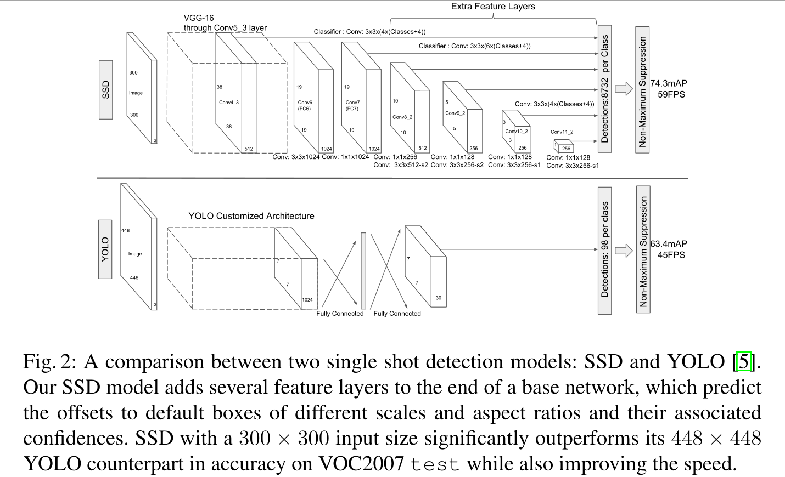

# SSD

全称为：Single Shot MultiBox Detector

one stage，多框、多尺度检测

生成锚框：给定n个大小s1, s2,..., sn 和 m个高宽比，以每个像素为中心，每个像素都生成n + m - 1个锚框

先用一个base网络抽取特征，再根据上述算法生成锚框

然后多个卷积层块都**高宽减半**，重复上述过程，每段都生成锚框（越顶层越多小物体）

对每个锚框预测类别和boundbox（可能锚框数量非常大）

> 速度快，精度一般
>
> SSD实现较RCNN简单很多

YOLO对锚框进行改进，由于SSD的锚框存在大量重叠，开销过大，YOLO将图像均匀分成SxS个锚框（见上文）

