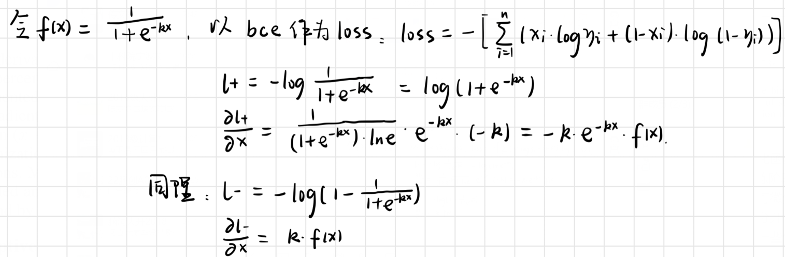

# dbnet论文阅读笔记

## Abstract

近年来，基于分割的方法在场景文本检测中非常流行，因为分割产生的结果能够更精确的描述**各种形状**的场景文本，如曲线文本。然而，二值化的后处理在基于分割的检测中是十分重要的，它将分割方法产生的probability map转换成文本的边界框。本文提出了一个可微二值化（DB）模块，它可以在一个分割网络中进行二值化处理。与DB模块一起优化的分割网络可以自适应地设置二值化阈值，这不仅简化了后处理，而且提高了文本检测的性能。

## Introduction

近年来，场景图像中的文本阅读由于其在图像/视频理解、视觉搜索、自动驾驶、盲人辅助等方面的广泛应用，成为一个活跃的研究领域。

场景文本检测作为场景文本阅读的关键组成部分，其目标是定位每个文本实例的边界框或区域，由于场景文本往往具有不同的尺度和形状，包括水平文本、多方向文本和弯曲文本，因此仍然是一项具有挑战性的任务。基于分割的场景文本检测近年来受到了广泛的关注，因为它可以描述各种形状的文本，这得益于它在像素级的预测结果。然而大多数基于分割的文本检测都需要复杂的后处理来将像素级预测probability map转化为检测文本实例框，这导致在推理过程中产生相当的的时间成本。以最近两种最先进的场景文本检测方法为例: PSENet (Wang et al. 2019a)提出了递进尺度扩展的后处理方法，以提高检测精度;(Tian et  al. 2019)中的像素嵌入是根据分割结果对像素进行聚类，需要计算像素之间的特征距离。

现有的检测方法大多采用类似的后处理流程(pipeline)，如图2所示(蓝色箭头后面):首先，设置一个固定的阈值，将分割网络生成的概率图转换为二值图像;  然后，使用一些启发式技术，如像素聚类，将像素分组到文本实例中。或者，像我们的流水线(图2中红色箭头后面)，其目的是**将二值化操作插入到分割网络中进行联合优化**。该方法可以**自适应预测图像中每个位置的阈值**，能够充分区分像素与前景和背景。然而，**标准二值化函数是不可微的，我们提出了一个用于二值化的近似函数，称为可微二值化(DB)**，当它与分割网络一起训练时，它是完全可微的。

> 注：二值化函数即相当于，当输入值超过阈值时输出1，否则为0；此函数显然不可微

本文的主要贡献是**提出的DB模块是可微的，这使得二值化过程端到端可训练的CNN**。通过将一个简单的语义分割网络和提出的DB模块相结合，我们提出了一种鲁棒且快速的场景文本检测器。通过使用DB模块的性能评估，我们发现我们的检测器与之前最先进的基于分段的方法相比有几个显著的优势。

1. 我们的方法在5个场景文本benchmark datasets上，包括水平文本、多方向文本和弯曲文本，都取得了较好的性能。
2. 我们的方法比以前的主要方法执行得更快，因为DB可以提供一个高度鲁棒的二值化映射，大大简化了后处理。
3. DB在使用轻量级baseline时工作得很好，与ResNet-18 baseline一起显著提高了检测性能。
4. 因为可以在推断阶段删除DB而不牺牲性能，所以测试没有额外的内存/时间成本。

## Related Work

当前的场景文本检测方法大致可以分为两大类:**基于回归**的方法和**基于分割**的方法。

## Methodology

我们提出的方法的体系结构如图3所示。首先，将输入图像送入特征金字塔骨架。其次，将金字塔特征上采样到相同尺度并级联生成特征F;然后，利用特征F预测**概率图(P)**和**阈值图(T)**。然后用P和F计算出近似二值图(ˆB)。在训练阶段，对**概率映射**、**阈值映射**和**近似二值映射**进行监督，其中概率映射和近似二值映射共享监督。在推理周期内，通过盒公式模块(box formulation module)，可以很容易地从近似二值映射或概率映射中得到bounding box。

### Binarization

#### Standard binarization

将分割网络生成的probability map转化成binary map是十分关键的一步，binary map中值为1的表示有效文本区域。通常，二值化处理可以被描述为：

上式中，t表示预设置的阈值，(i, j)表示map上的坐标点。

#### Differentiable binarization

可微的二值化

上面的标准二值化是不可微的。因此，在训练阶段中不能随着神经网络一起优化（不能求导）。为了解决这个问题，我们提出用一个近似的步长函数进行二值化:

其中B表示近似的binary map；T是从神经网络中学习到的自适应阈值map。根据经验，K被设为50。

> 即当probability > threshold 时binary=1，道理是一样的，其中还有sigmoid的思想。很巧妙的把阈值函数转换成可微的函数。

该近似二值化函数与标准二值化函数相似(见图4)，但具有可微性，可以在训练阶段随分割网络进行优化。具有自适应阈值的可微分二值化方法不仅可以将文本区域与背景区分开，还可以将紧密连接的文本实例分离开来。一些例子如图7所示。

DB提高性能的原因可以用梯度的反向传播来解释：

#### Adaptive threshold

图1中的threshold map在外观上与(Xue,  Lu, and Zhan  2018)中的text border map相似。然而，threshold map的动机和用法不同于text border map。有无监督的threshold map如图6所示。即使没有对threshold map进行监督，threshold map也会突出text border区域。这表明类似边界的threshold map有利于最终结果。因此，我们在threshold map上应用类边界监督来更好地指导。在实验部分讨论了关于监督的消融研究。在使用中，我们使用(Xue,  Lu, and Zhan 2018)中的text border map来分割文本实例，而threshold map作为二值化的阈值。

#### Deformable convolution

可形变卷积：就是在这些卷积层上，添加了位移变量，这个变量根据数据的情况学习，偏移后，相当于卷积核每个方块可伸缩的变化，从而改变了感受野的范围，感受野成了一个多边形。

上图是在二维平面上deformable convolution和普通的convolution的描述图。（a）是普通的卷积，卷积核大小为3*3，采样点排列非常规则，是一个正方形。（b）是可变形的卷积，给每个采样点加一个offset（这个offset通过额外的卷积层学习得到），排列变得不规则。（c）和（d）是可变形卷积的两种特例。对于（c）加上offset，达到**尺度变换**的效果；对于（d）加上offset，达到**旋转变换**的效果。

如上图所示，有一个额外的conv层来学习offset，共享input feature maps。然后input feature maps和offset共同作为deformable conv层的输入，deformable conv层操作采样点发生偏移，再进行卷积。

可以为模型提供一个灵活的接受域，这对极端纵横比的文本实例尤其有益。随后，在ResNet-18或ResNet-50中conv3、conv4、conv5卷积层中的所有3x3卷积都使用了模块化的空洞卷积。

#### Label generation

概率图的标签生成受到PSENet的启发(Wang  et al. 2019a)。给定文本图像，其文本区域的每个多边形由一组片段描述。

> 受到 PSENet (Wang et al. 2019a)的启发，使用 Vatti clipping algorithm  （offset: D = A*(1-r*r)/L）将 polygons 的集合 G 缩减 offset 到 Gs（上图 蓝线内部），A 是面积，L 是周长，r 是 shrink ratio，设置为 0.4，类似地， 可以生成阈值图的标签, 向外进行扩张，得到绿线和蓝线中间的区域 Gd; 最 终的标签在 Gs 与 Gd 之间生成。 

#### Optimization

损失函数L可以表示为probability map的损失Ls，binary map的损失Lb和threshold map的损失Lt的加权求和。

根据loss的数值，α和β分别设为1.0和10。

我们对Ls和Lb都采用了BCE loss，为了克服正负数量的不平衡，我们采用了**困难负样本挖掘**方法，通过对困难负样本进行采样来实现BCE损耗。

> `Sl`是正负样本比例1：3的采样集合
>
> `Lt`计算prediction和dilated text polygon label的L1距离
>
> > 
> >
> > 其中`Rd`是dilated polygon的集合`yi*`是threshold 的真值label。

在推理阶段，我们可以使用probability map或近似的binary map来生成文本边界框，这两种方法的结果几乎相同。为了提高效率，我们使用了probability map，从而可以去除阈值分支。

盒子形成过程包括三个步骤:

(1)probability map/近似binary map先用一个常数阈值(0.2)进行二值化，得到二值图;

(2)由二值映射得到连通区域(shrunk text region);

(3)利用Vatti裁剪算法(Vati 1992)的偏移D`对shrunk region进行dilate。

其中A\`是shrunk polygon的面积，L\`是shrunk polygon的周长，r\`根据经验设为1.5。