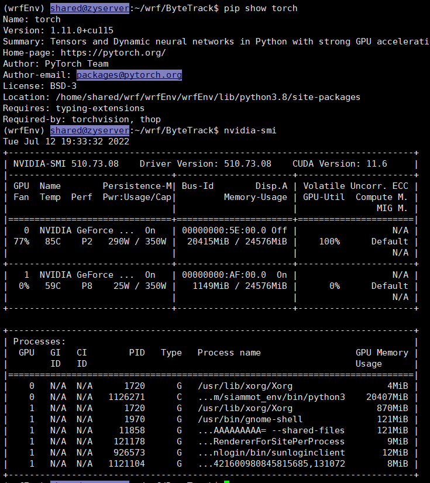

链接导航栏

*课程github地址：https://github.com/datawhalechina/thorough-pytorch 
*课程gitee地址：https://gitee.com/datawhalechina/thorough-pytorch 
*B站视频：https://www.bilibili.com/video/BV1L44y1472Z

## Task1

### 1.学习PyTorch环境搭建

这里分享几个安装torch相关库常用的链接，也方便日后再查看

https://download.pytorch.org/whl/torch/

https://download.pytorch.org/whl/torchvision/

https://www.lfd.uci.edu/~gohlke/pythonlibs/



还有切换cuda版本的指令

```sh
#<<< config root's cuda  start <<<
export PATH=/usr/local/cuda-11.0/bin:$PATH
export CUDA_HOME=/usr/local/cuda-11.0/bin:$CUDA_HOME
export LD_LIBRARY_PATH=/usr/local/cuda-11.0/lib64:/usr/local/cuda-11.0/extras/CUPTI/lib64:$LD_LIBRARY_PATH
# cuda-10.2
#<<< config root's cuda  end <<<
```

### 2.torch基础知识

要阻止一个张量被跟踪历史，可以调用`.detach()`方法将其与计算历史分离

`Tensor `和` Function` 互相连接生成了一个无环图 (acyclic graph)，它编码了完整的计算历史

注意grad在反向传播过程中是累加的(accumulated)，这意味着每一次运行反向传播，梯度都会累加之前的梯度，所以一般在反向传播之前需把梯度清零。

### 3.数据加载方式总结

（1）使用torchvision的ImageFolder 方法

```python
import torch
from torchvision import datasets
train_data = datasets.ImageFolder(train_path, transform=data_transform)
val_data = datasets.ImageFolder(val_path, transform=data_transform)
```

（2）继承Dataset类+torch.utils.data的DataLoader方法

定义的类需要继承PyTorch自身的Dataset类。主要包含三个函数：

- `__init__`: 用于向类中传入外部参数，同时定义样本集
- `__getitem__`: 用于逐个读取样本集合中的元素，可以进行一定的变换，并将返回训练/验证所需的数据
- `__len__`: 用于返回数据集的样本数

构建好Dataset后用DataLoader读入数据

```python
from torch.utils.data import DataLoader

train_loader = torch.utils.data.DataLoader(train_data, batch_size=batch_size, num_workers=4, shuffle=True, drop_last=True)
val_loader = torch.utils.data.DataLoader(val_data, batch_size=batch_size, num_workers=4, shuffle=False)
```

上述使用Dataloader加载的数据可以转化为迭代器，使用next来读取（ImageFolder加载的数据也可以）

```python
images, labels = next(iter(val_loader))
print(images.shape)
plt.imshow(images[0].transpose(1,2,0))
```

### 4.模型构建

卷积层

```python
# 手动实现
# 卷积运算（二维互相关）
def corr2d(X, K): 
    h, w = K.shape
    X, K = X.float(), K.float()
    Y = torch.zeros((X.shape[0] - h + 1, X.shape[1] - w + 1))
    for i in range(Y.shape[0]):
        for j in range(Y.shape[1]):
            Y[i, j] = (X[i: i + h, j: j + w] * K).sum()
    return Y
# 二维卷积层
class Conv2D(nn.Module):
    def __init__(self, kernel_size):
        super(Conv2D, self).__init__()
        self.weight = nn.Parameter(torch.randn(kernel_size))
        self.bias = nn.Parameter(torch.randn(1))
    def forward(self, x):
        return corr2d(x, self.weight) + self.bias

# nn函数二维卷积层
conv2d = nn.Conv2d(in_channels=1, out_channels=1, kernel_size=3,padding=1)

# 定义一个函数来计算卷积层。它对输入和输出做相应的升维
# 注意(1, 1) + X.shape，元组的相加是连接作用
def comp_conv2d(conv2d, X):
    # (1, 1)代表批量大小和通道数
    X = X.view((1, 1) + X.shape)
    Y = conv2d(X)
    return Y.view(Y.shape[2:]) # 这里排除不关心的前两维:批量和通道——输出仍为原shape

```

池化层

```python 
# 手动实现
def pool2d(X, pool_size, mode='max'):
    p_h, p_w = pool_size
    Y = torch.zeros((X.shape[0] - p_h + 1, X.shape[1] - p_w + 1))
    for i in range(Y.shape[0]):
        for j in range(Y.shape[1]):
            if mode == 'max':
                Y[i, j] = X[i: i + p_h, j: j + p_w].max()
            elif mode == 'avg':
                Y[i, j] = X[i: i + p_h, j: j + p_w].mean()
    return Y

# nn.functional函数(卷积Conv是在nn就有)
import torch.nn.functional as F
x = F.max_pool2d(x, (2, 2))
```

### 5.模型参数初始化

对卷积使用xavier初始化，对于全连接层使用normal初始化，对于BN使用权重置1偏差置0

```python
def initialize_weights(self):
	for m in self.modules():
		# 判断是否属于Conv2d
		if isinstance(m, nn.Conv2d):
			torch.nn.init.xavier_normal_(m.weight.data)
			# 判断是否有偏置
			if m.bias is not None:
				torch.nn.init.constant_(m.bias.data,0.3)
		elif isinstance(m, nn.Linear):
			torch.nn.init.normal_(m.weight.data, 0.1)
			if m.bias is not None:
				torch.nn.init.zeros_(m.bias.data)
		elif isinstance(m, nn.BatchNorm2d):
			m.weight.data.fill_(1) 		 
			m.bias.data.zeros_()	
```

### 6.损失函数

### 7.训练

前面提到train_loader可以作为迭代器，因此可以用`for data, label in train_loader:`读取数据

`data, label = data.cuda(), label.cuda()`转为GPU模式

开始用当前批次数据做训练时，应当先将优化器的梯度置零：

`optimizer.zero_grad()`

之后将data送入模型中训练：

`output = model(data)`

根据预先定义的criterion计算损失函数：

`loss = criterion(output, label)`

将loss反向传播回网络：

`loss.backward()`

使用优化器更新模型参数：

`optimizer.step()`

## Task3

### 1.定义模型的方式：

nn.Sequential()——直接构建出一个模型，包括数据传递的路径，不易拓展，但书写简便，不用写forward

nn.ModuleList()——先把模型的各个部分定义在一个模型列表中，可以append加入模块，用下标索引查看模块，数据传递路径在forward中书写

nn.ModuleDict()——类似ModuleList，多了一个模块名可以作为key写入的功能

### 2.模型存储方式

对于PyTorch而言，pt, pth和pkl**三种数据格式均支持模型权重和整个模型的存储**，因此使用上没有差别。

PyTorch中将模型和数据放到GPU上有两种方式——.cuda()和.to(device)

### 3.多卡nn.DataParallel()

由于训练和测试所使用的硬件条件不同，在模型的保存和加载过程中可能因为单GPU和多GPU环境的不同带来模型不匹配等问题。

多卡GPU操作的不同之处在于多一步把加载了参数(dict)的模型扔进nn.DataParallel()，这步操作后再.cuda；多卡训练的结果关键区别是会在权重参数的key值上加一个“module”，因此多卡训练单卡测试时只要多一步model.module()提取出来即可（如果保存的时候是权重和结构一起save），如果保存的时候只保存了权重参数，则有两种思路，一种是给模型结构加上module（扔到nn.DataParallel()），另一种是遍历权重参数的字典的key，去除module(loaded_model.load_state_dict({k.replace('module.', ''): v for k, v in loaded_dict.items()}))；

如果模型保存和加载都是使用多卡，则不会有参数前缀不同（module）的问题，但如果是保存完整的模型结构和参数权重，此时会同时保存GPU id，在加载模型时也要考虑GPU id能对的上，而如果训练时保存的是权重就不会有GPU id的问题

model.load_state_dict(model_dict) 等价于model.state_dict=model_dict(均可实现在模型结构上加载参数)

