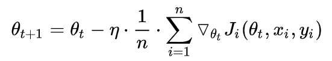
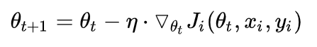
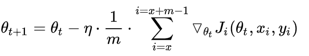
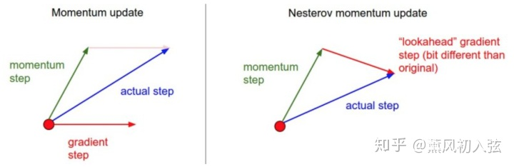

## 优化算法

参考：[论文阅读笔记：各种Optimizer梯度下降优化算法回顾和总结 - 知乎 (zhihu.com)](https://zhuanlan.zhihu.com/p/343564175)

​			[An overview of gradient descent optimization algorithms (arxiv.org)](https://arxiv.org/pdf/1609.04747.pdf)

**一阶方法**：随机梯度下降（SGD）、动量（Momentum）、牛顿动量法（Nesterov动量）、AdaGrad（自适应梯度）、RMSProp（均方差传播）、Adam、Nadam。

**二阶方法**：牛顿法、拟牛顿法、共轭梯度法（CG）、BFGS、L-BFGS。

> 二阶导数（Hessian）计算成本高，一般不用

**自适应优化算法**：Adagrad（累积梯度平方），RMSProp（累积梯度平方的滑动平均）、Adam（带动量的RMSProp，即同时使用梯度的一、二阶矩））

**梯度下降陷入局部最优有什么解决办法？** 可以用BGD、SGD、MBGD、momentum，RMSprop，Adam等方法来避免陷入局部最优。

[TOC]

```python
# Momentum
	v = mu * v - lr * dx # 与速度融合
    x += v # 与位置融合   
# Nes
	x_ahead = x + mu * v
	#   计算dx_ahead(在x_ahead处的梯度，而不是在x处的梯度)
    v = mu * v - learning_rate * dx_ahead
    x += v
# Adagrad
    v += dx**2
    x += -lr * dx / np.sqrt(v+eps)
# Adadelta
    v += beta2*v + (1 - beta2) * (dx**2)
    x += -lr * dx / np.sqrt(v+eps)
"""
好像Adadelta和RMSprop几乎一样，但是在Adadelta中还有使用牛顿法使得lr不依赖全局，比Adadelta似乎更先进
"""
# RMSprop
	cache = decay_rate * cache + (1 - decay_rate) * (dx**2)
    x += - lr * dx / np.sqrt(cache + eps)
"""
Adam和RMSProp很像，除了使用的是平滑的梯度m，而不是原始梯度（带动量）
"""
# Adam
	m = beta1*m + (1 - beta1) * dx
    v = beta2*v + (1 - beta2) * (dx**2)
    x += - lr * m / np.sqrt(v + eps)
```

### 1、梯度下降算法

#### **①批量梯度下降（BGD）**

批量梯度下降法，是梯度下降法最常用的形式，具体做法也就是在更新参数时使用~~**所有的样本**~~    **batch里的所有样本梯度的均值**来进行更新



> **优点**：（1）一次迭代是对batch内所有样本进行计算，此时利用矩阵进行操作，实现了并行。
>
> ​			（2）由全数据集确定的方向能够更好地代表样本总体，从而更准确地朝向极值所在的方向。当目标函数为凸函数时，BGD一定能够得到全局最优。
>
> **缺点**：（1）当样本数目 m 很大时，每迭代一步都需要对所有样本计算，训练过程会很慢。
>
> ​			（2）不能投入新数据实时更新模型。

#### **②随机梯度下降（SGD）**

随机梯度下降法求梯度时选取**一个样本**j来求梯度。



> **优点：**（1）由于不是在全部训练数据上的损失函数，而是在每轮迭代中，随机优化某一条训练数据上的损失函数，这样每一轮**参数的更新速度大大加快**。
>
> **缺点：**（1）准确度下降，训练波动较大。由于即使在目标函数为强凸函数的情况下，SGD仍旧**无法做到线性收敛**。（2）可能会收敛到**局部最优**，由于**单个样本并不能代表全体样本的趋势**。（3）不易于并行实现。SGD 因为更新比较频繁，会造成 cost function 有**严重的震荡**。

#### **③小批量梯度下降算法（mini-batch GD）**

小批量梯度下降法是是对于m个样本，我们采用x个子样本来迭代，1<x<m。一般可以取x=10，当然根据样本的数据，可以调整这个x的值。



> 优点：（1）每次在一个batch上优化神经网络参数并不会比单个数据慢太多。
>
> ​			（2）每次使用一个batch可以大大减小收敛所需要的迭代次数，同时可以使收敛到的结果更加接近梯度下降的效果。(比如上例中的30W，设置batch_size=100时，需要迭代3000次，远小于SGD的30W次)
>
> ​			（3）可实现并行化。
>
> 缺点：lr和batch_size不好选择

### 2、梯度下降算法改进

#### **①动量梯度下降法（Momentum）**

Momentum 通过加入 γ*vt−1 ，可以加速 SGD， 并且抑制震荡。


```python
# 动量更新
    v = mu * v - learning_rate * dx # 与速度融合
    x += v # 与位置融合
```

上式中第一行表示vt受到前一个vt的影响，r通常取值0.9，表示动量，再加上当前梯度（第一行后一项）得到动量梯度

动量主要解决SGD的两个问题：

- 随机梯度的方法（引入的噪声）
- Hessian矩阵病态问题（可以理解为SGD在收敛过程中和正确梯度相比来回摆动比较大的问题）。

#### ② **Nesterov动量**

与普通动量不同，最近比较流行。在理论上对于凸函数能更好的收敛，在实践中也表现更好。

NAG(Nesterov accelerated gradient）算法，是Momentum动量算法的变种。momentum保留了上一时刻的梯度 ![[公式]](C:%5CUsers%5CBreeze%5CDesktop%5Cgra_proj%5Cgraduation_project%5Cdive-into-dl-pytorch-notes%5Cimages%5Cequation-1648631275955.svg) ，对其没有进行任何改变，NAG是momentum的改进，在梯度更新时做一个矫正，具体做法就是在当前的梯度上添加上一时刻的动量 ![[公式]](C:%5CUsers%5CBreeze%5CDesktop%5Cgra_proj%5Cgraduation_project%5Cdive-into-dl-pytorch-notes%5Cimages%5Cequation-1648631275860.svg) ，梯度改变为 ![[公式]](C:%5CUsers%5CBreeze%5CDesktop%5Cgra_proj%5Cgraduation_project%5Cdive-into-dl-pytorch-notes%5Cimages%5Cequation-1648631275926.svg) ，（θ - β1*mt 即表示动量推动后的位置）参数更新公式如下：

![[公式]](./images/equation-1648631275974.svg)

```python
x_ahead = x + mu * v
#   计算dx_ahead(在x_ahead处的梯度，而不是在x处的梯度)
v = mu * v - learning_rate * dx_ahead
x += v  
```

上面、下面代码等同（<font color='red'>不大理解下面这个怎么推的</font>）

```python
v_prev = v # 存储备份
v = mu * v - learning_rate * dx # 速度更新保持不变
x += -mu * v_prev + (1 + mu) * v # 位置更新变了形式
```

如下图所示，与Momentum区别在于，Momentum是在红色点处计算梯度，也就是上一时刻的梯度；Nesterov的改进则是在动力推动前进的基础上再算梯度（绿色箭头末端）



#### **③ Adagrad**

Adagrad其实是对学习率进行了一个约束，对于经常更新的参数（梯度平方和较大），我们已经积累了大量关于它的知识，不希望被单个样本影响太大，希望学习速率慢一些；对于偶尔更新的参数（梯度平方和较小），我们了解的信息太少，希望能从每个偶然出现的样本身上多学一些，即学习速率大一些。而该方法中开始使用二阶动量，才意味着“自适应学习率”优化算法时代的到来。

我们前面都没有好好的讨论二阶动量，二阶动量是个啥？它是用来度量历史更新频率的，二阶动量是迄今为止所有梯度值的平方和，即 ![[公式]](./images/equation-1648609853822.svg) ，有 ![[公式]](./images/equation-1648609853748.svg) （在这里 ![[公式]](./images/equation-1648609853788.svg) ）， 也就是说，我们的学习率现在是 ![[公式]](./images/equation-1648609853823.svg) （一般为了避免分母为0，会在分母上加一个小的平滑项 ![[公式]](C:%5CUsers%5CBreeze%5CDesktop%5Cgra_proj%5Cgraduation_project%5Cdive-into-dl-pytorch-notes%5Cimages%5Cequation-1648609853781.svg) ），从这里我们就会发现 ![[公式]](./images/equation-1648609853813.svg) 是恒大于0的，而且参数更新越频繁，二阶动量越大，学习率就越小，这一方法在稀疏数据场景下表现非常好，参数更新公式如下：

![[公式]](./images/equation-1648609853759.svg)

```python
v += dx**2
x += -lr*dx/np.sqrt(v+eps)
```

细心的小伙伴应该会发现Adagrad还是存在一个很明显的缺点：

- 仍需要手工设置一个全局学习率 ![[公式]](C:%5CUsers%5CBreeze%5CDesktop%5Cgra_proj%5Cgraduation_project%5Cdive-into-dl-pytorch-notes%5Cimages%5Cequation-1648609853816.svg) , 如果 ![[公式]](C:%5CUsers%5CBreeze%5CDesktop%5Cgra_proj%5Cgraduation_project%5Cdive-into-dl-pytorch-notes%5Cimages%5Cequation-1648609853816.svg) 设置过大的话，会使regularizer过于敏感，对梯度的调节太大
- 中后期，分母上梯度累加的平方和会越来越大，使得参数更新量趋近于0，使得训练提前结束，无法学习

由上图最后一个式子知，Adagrad的**学习率是动态变化**的

> **优点**：减少了学习率的手动调节。超参数设定值：一般η选取0.01。
>
> **缺点**：它的缺点是分母会不断积累，这样学习率就会收缩并最终会变得非常小。

#### **④ Adadelta**

由于AdaGrad调整学习率变化过于激进，我们考虑一个改变二阶动量计算方法的策略：**不累积全部历史梯度**（     没有对之前的梯度求和的操作），而只关注过去一段时间窗口的下降梯度，即Adadelta只累加固定大小的项，并且也不直接存储这些项，仅仅是近似计算对应的平均值（指数移动平均值），这就避免了二阶动量持续累积、导致训练过程提前结束的问题了，参数更新公式如下：

![[公式]](./images/equation-1648610012640.svg)

```python
v += beta2*v + (1-beta2)(dx**2)
x += -lr*dx/np.sqrt(v+eps)
```

观察上面的参数更新公式，我们发现还是依赖于全局学习率 ![[公式]](C:%5CUsers%5CBreeze%5CDesktop%5Cgra_proj%5Cgraduation_project%5Cdive-into-dl-pytorch-notes%5Cimages%5Cequation-1648610012533.svg) ，但是原作者在此基础之上做出了一定的处理，上式经过牛顿迭代法之后，得到Adadelta最终迭代公式如下式，其中 ![[公式]](C:%5CUsers%5CBreeze%5CDesktop%5Cgra_proj%5Cgraduation_project%5Cdive-into-dl-pytorch-notes%5Cimages%5Cequation-1648610012554.svg) ：<font color='red'>不知道怎么推的=></font>

![[公式]](./images/equation-1648610012602.svg)

**此时可以看出Adadelta已经不依赖全局learning rate了**，Adadelta有如下特点：

- 训练初中期，加速效果不错，很快
- 训练后期，反复在局部最小值附近抖动

#### **⑤ RMSprop**

RMSProp算法修改了AdaGrad的梯度平方和累加为**指数加权（就是把AdaGrad的简单”全部求和“改成”最近两次“的加权平均）**的移动平均，使得其在非凸设定下效果更好。设定参数：全局初始率 ![[公式]](C:%5CUsers%5CBreeze%5CDesktop%5Cgra_proj%5Cgraduation_project%5Cdive-into-dl-pytorch-notes%5Cimages%5Cequation-1648610365538.svg) , 默认设为0.001，decay rate ![[公式]](C:%5CUsers%5CBreeze%5CDesktop%5Cgra_proj%5Cgraduation_project%5Cdive-into-dl-pytorch-notes%5Cimages%5Cequation-1648610365537.svg) ，默认设置为0.9，一个极小的常量 ![[公式]](C:%5CUsers%5CBreeze%5CDesktop%5Cgra_proj%5Cgraduation_project%5Cdive-into-dl-pytorch-notes%5Cimages%5Cequation-1648610365532.svg) ，通常为10e-6，参数更新公式如下，其中 ![[公式]](C:%5CUsers%5CBreeze%5CDesktop%5Cgra_proj%5Cgraduation_project%5Cdive-into-dl-pytorch-notes%5Cimages%5Cequation-1648610365545.svg) ：

![[公式]](./images/equation-1648610365556.svg)

```python
# 伪代码：（上公式中倒三角好像表示的是参数更新）
cache = decay_rate * cache + (1 - decay_rate) * dx**2
x += - learning_rate * dx / (np.sqrt(cache) + eps)
```

- 其实RMSprop依然**依赖于全局学习率 ![[公式0]](C:%5CUsers%5CBreeze%5CDesktop%5Cgra_proj%5Cgraduation_project%5Cdive-into-dl-pytorch-notes%5Cimages%5Cequation-1648610365538.svg)**
- RMSprop算是Adagrad的一种发展，和Adadelta的变体，效果趋于二者之间
- 适合处理非平稳目标(包括季节性和周期性)——对于RNN效果很好

#### **⑥ Adaptive Moment Estimation（Adam）**

我们看到，SGD-M和NAG在SGD基础上增加了一阶动量，AdaGrad和AdaDelta在SGD基础上增加了二阶动量。其实有了前面的方法，Adam和Nadam的出现就很理所当然的了，因为它们结合了前面方法的**一阶动量**和**二阶动量**，参数更新公式如下（按照最开始总结的计算框架）：

![[公式]](./images/equation-1648610720278.svg)

注意，**<font color='blue'>Adam和RMSProp很像，除了使用的是平滑的梯度m，而不是原始梯度dx</font>**。

通常情况下，默认值为 ![[公式]](C:%5CUsers%5CBreeze%5CDesktop%5Cgra_proj%5Cgraduation_project%5Cdive-into-dl-pytorch-notes%5Cimages%5Cequation-1648610720194.svg) 、 ![[公式]](C:%5CUsers%5CBreeze%5CDesktop%5Cgra_proj%5Cgraduation_project%5Cdive-into-dl-pytorch-notes%5Cimages%5Cequation-1648610720154.svg) ，Adam通常被认为对超参数的选择相当鲁棒，特点如下：

- Adam梯度经过偏置校正后，每一次迭代学习率都有一个固定范围，使得参数比较平稳。
- 结合了**Adagrad**善于处理稀疏梯度和**RMSprop**善于处理非平稳目标的优点
- 为不同的参数计算不同的自适应学习率
- 也适用于大多非凸优化问题——适用于大数据集和高维空间。

#### **⑦ AdaMax**

Adamax是Adam的一种变体，此方法对学习率的上限提供了一个更简单的范围，即使用无穷范式，参数更新公式如下：

![[公式]](./images/equation-1648610918057.svg)

通常情况下，默认值为 ![[公式]](./images/equation-1648610918032.svg) 、 ![[公式]](./images/equation-1648610918038.svg) 和 ![[公式]](./images/equation-1648610918031.svg)

#### **⑧ Nadam**

其实如果说要集成所有方法的优点于一身的话，Nadam应该就是了，Adam遗漏了啥？没错，就是Nesterov项，我们在Adam的基础上，加上Nesterov项就是Nadam了，参数更新公式如下：

![[公式]](./images/equation-1648610933906.svg)

可以看出，Nadam对学习率有更强的约束，同时对梯度的更新也有更直接的影响。一般而言，在使用带动量的RMSprop或Adam的问题上，使用Nadam可以取得更好的结果。