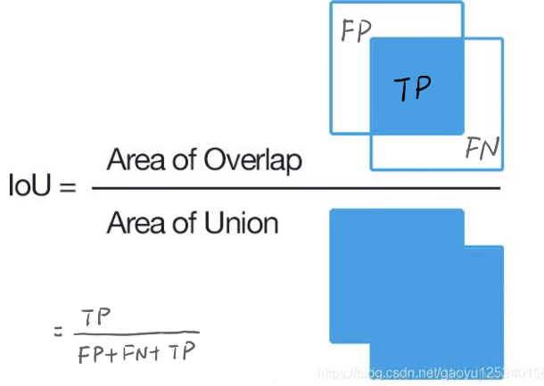

## 复试准备

[TOC]

#### 简述一下UNet网络

> 先是两个卷积操作`(convolution => [BN] => ReLU)`
>
> 再下采样，学习不同深层次的特征，
>
> 上采样恢复到原图大小，同时跳跃连接，最后使用激活函数softmax将特征图转化为概率图

#### 常见激活函数

##### sigmoid函数

> sigmoid函数也叫Logistic函数，用于隐藏层的输出，输出在(0,1)之间，它可以将一个实数映射到(0,1)的范围内，可以用来做二分类。该函数将大的负数转换成0，将大的正数转换为1
>
> 
>
> 
>
> 缺点:
>
> - **梯度消失**：Sigmoid 函数值趋近 0 和 1 的时候变化率会变得**过于平坦**，也就是说，Sigmoid 的梯度趋近于 0。神经网络使用 Sigmoid 激活函数进行反向传播时，输出接近 0 或 1 的神经元其梯度趋近于 0。这些神经元叫作饱和神经元。因此，这些神经元的权重不会更新。此外，与此类神经元相连的神经元的权重也更新得很慢。该问题叫作梯度消失。因此，想象一下，如果一个大型神经网络包含 Sigmoid 神经元，而其中很多个都处于饱和状态，那么该网络无法执行反向传播。
> - **不以零为中心**：Sigmoid 输出不以零为中心（中心是(0, 0.5)）。如果输入神经元的数据总是正数，那么关于![[公式]](C:%5CUsers%5CBreeze%5CDesktop%5Cgra_proj%5Cgraduation_project%5Cdive-into-dl-pytorch-notes%5Cimages%5Cequation-1647759046921.svg)的梯度在反向传播的过程中，将会要么全部是正数，要么全部是负数，这将会导致梯度下降权重更新时出现z字型的下降，使得神经网络**收敛缓慢**。[谈谈激活函数以零为中心的问题 | 始终 (liam.page)](https://liam.page/2018/04/17/zero-centered-active-function/)
> - **计算成本高昂**：exp() 函数与其他非线性激活函数相比，计算成本高昂。


##### tanh函数

> 双曲正切激活函数
>
> 将实数值压缩到[-1,1]之间
>
> 两个公式等价：
>
> 
>
> 
>
> Tanh解决了Sigmoid的输出是不是零中心的问题，但仍然存在**饱和问题**（梯度消失），计算量也仍然很大。
>
> **为了防止饱和，现在主流的做法会在激活函数前多做一步\*batch normalization\*，尽可能保证每一层网络的输入具有均值较小的、零中心的分布。**


##### ReLU

> 线性修正单元激活函数
>
> 
>
> 
>
> 当输入 x<0 时，输出为 0，当 x> 0 时，输出为 x。该激活函数使网络更快速地收敛。它不会饱和，即它可以对抗梯度消失问题，至少在正区域（x> 0 时）可以这样，因此神经元至少在一半区域中不会把所有零进行反向传播。由于使用了简单的阈值化（thresholding），ReLU 计算效率很高。
>
> Relu激活函数缺点：
>
> - 不以零为中心：和 Sigmoid 激活函数类似，ReLU 函数的输出不以零为中心。
> - 前向传导（forward pass）过程中，如果 x < 0，则神经元保持非激活状态，且在后向传导（backward pass）中「杀死」梯度（因为x < 0的时候整个值都是0， 导数也是0，梯度等于0）。这样权重无法得到更新，网络无法学习。当 x = 0 时，该点的梯度未定义，但是这个问题在实现中得到了解决，通过采用左侧或右侧的梯度的方式。
>
> 尽管存在这两个问题，**ReLU目前仍是最常用的activation function，在搭建人工神经网络的时候推荐优先尝试！**


##### Leaky ReLU

> 
>
> 其中 ![[公式]](C:%5CUsers%5CBreeze%5CDesktop%5Cgra_proj%5Cgraduation_project%5Cdive-into-dl-pytorch-notes%5Cimages%5Cequation-1647759965840.svg) 是很小的负数梯度值，比如0.01，Leaky ReLU非线性函数图像如下图所示。这样做目的是使负轴信息不会全部丢失，解决了ReLU神经元“死掉”的问题。更进一步的方法是PReLU，即把 ![[公式]](C:%5CUsers%5CBreeze%5CDesktop%5Cgra_proj%5Cgraduation_project%5Cdive-into-dl-pytorch-notes%5Cimages%5Cequation-1647759965840.svg) 当做每个神经元中的一个参数，是可以通过梯度下降求解的。
>
> 
>
> 该函数一定程度上缓解了 dead ReLU 问题。


##### SoftMax

> 
>
> 看了下图就非常好理解！
>
> 
>
> Softmax是Sigmoid的扩展，当类别数k＝2时，Softmax回归退化为Logistic回归。


#### 简述encode和decode思想

> 将一个input信息编码到一个压缩空间中；将一个压缩空间向量解码到一个原始空间中


#### 分割出的结果存在不连续的情况如何处理？

> 开运算闭运算
>
> 膨胀：求局部最大值
>
> 腐蚀：求局部最小值
>
> 设定阈值，去掉阈值较小的连通集，和较小的空洞。
>
> > **开运算 = 先腐蚀运算 -> 再膨胀运算**（看上去是把细微连在一起的两块目标分开了）
> >
> > **开运算**总结：
> >
> > （１）开运算能够除去**孤立的小点，毛刺和小桥**，而总的位置和形状不变。
> >
> > （２）开运算是一个基于几何运算的滤波器。
> >
> > （３）结构元素大小的不同将导致滤波效果的不同。
> >
> > （４）不同的结构元素的选择导致了不同的分割，即提取出不同的特征。
>
> > **闭运算 = 先膨胀运算 -> 再腐蚀运算**（看上去是将两个细微连接的图块封闭在一起）
> >
> > **闭运算**总结：
> >
> > （1）闭运算能够**填平小湖（即小孔），弥合小裂缝**，而总的位置和形状不变。
> >
> > （2）闭运算是通过填充图像的凹角来滤波图像的。
> >
> > （3）结构元素大小的不同将导致滤波效果的不同。
> >
> > （4）不同结构元素的选择导致了不同的分割。


#### 简述mIoU

> 平均交并比
>
> `IoU = TP/（FN + FP + TP）` 
>
> 
>
> ```python
> Iand = torch.sum(target[i, :, :, :] * pred[i, :, :, :])
> Ior = torch.sum(target[i, :, :, :]) + torch.sum(pred[i, :, :, :]) - Iand1
> IoU = Iand / Ior
> ```


#### 常见evaluation metric：

##### 1、accuracy准确率 = TP+TN / (TP+FP+FN+TN)

​		在binary classification且正负样本不平衡的情况下，尤其是对minority class更感兴趣的时候，accuracy评价基本没有参考价值，比如fraud detection（欺诈检测），癌症检测，举个例子：在测试集里，有100个sample，99个反例，只有1个正例。即使我的模型不分青红皂白对任意一个sample都预测是反例，那么我的模型的accuracy也可以高达： 正确的个数／总个数 = 99/100 = 99%

##### 2、precision | recall

relevant elements：正样本

selected elements：预测为正的样本


**recall（查全率）**是相对真实的答案而言： true positive ／ golden set 。假设测试集里面有100个正例，你的模型能预测覆盖到多少，如果你的模型预测到了40个正例，那你的recall就是40%。

**precision（查准率）**是相对你自己的模型预测而言：true positive ／retrieved set。假设你的模型一共预测了100个正例，而其中80个是对的正例，那么你的precision就是80%。我们可以把precision也理解为，当你的模型作出一个新的预测时，它的confidence score 是多少，或者它做的这个预测是对的的可能性是多少。

一般来说呢，鱼与熊掌不可兼得。如果你的模型很贪婪，想要覆盖更多的sample，那么它就更有可能犯错。在这种情况下，你会有很高的recall，但是较低的precision。如果你的模型很保守，只对它很sure的sample作出预测，那么你的precision会很高，但是recall会相对低。

p-r curve

曲线下的面积(AUC)越大，或者说曲线更接近右上角（precision=1， recall=1），那么模型就越理想，越好。

> **AP** (average Precision)：平均精度，在不同recall下的最高precision的均值(一般会对各类别分别计算各自的AP)。
>
> **mAP** (mean AP)：平均精度的均值，各类别的AP的均值。
>
> [rafaelpadilla/Object-Detection-Metrics: Most popular metrics used to evaluate object detection algorithms. (github.com)](https://github.com/rafaelpadilla/Object-Detection-Metrics)

##### 3、F1-score

> F-score又称F-measure
>
> 

综合考虑precision和recall： `2 * precision * recall / (precision + recall)`

当两个模型，一个precision特别高，recall特别低，另一个recall特别高，precision特别低的时候，f1-score可能是差不多的

> **F-Measure是Precision和Recall加权调和平均**
>
> 

##### 4、sensitivity、specificity、ROC curve

sensitivity(敏感度) = recall = true positive rate = TPR = **TP / (TP + FN)** **<font color='blue'>（TPR考虑的都是正样本）</font>**

specificity(精确度) = 1- false positive rate = 1 - FPR = **1 - FP / (FP + TN)** **<font color='blue'>（FPR考虑的都是负样本）</font>**

举一个简单的例子方便理解。假设现在有10个雷达信号警报，其中8个是真的轰炸机（P）来了，2个是大鸟（N）飞过，经过某分析员解析雷达的信号，判断出9个信号是轰炸机，剩下1个是大鸟，其中被判定为轰炸机的信号中，有1个其实是大鸟的信号（FP=1），而剩下8个确实是轰炸机信号（TP=8）。因此可以计算出FPR为                `   FPR = 1/(2) = 0.5`，TPR为`TPR = 8 / 8 = 1`，而)就对应ROC曲线上一点。

**注意specificity中FPR的假阳性概率是指假阳性样本在所有阴性样本中的占比，而不是在所有真阳性中的占比（算一下上面的例子就知道）**

<font color='blue'>TPR相当于“正样本”召回率，FPR相当于“负样本”召回率</font>

ROC curve：**横轴 -> FPR, 纵轴 -> TPR**

**AUC**是**ROC**曲线下的面积大小，而计算AUC值只需要沿着ROC横轴做积分就可以了。真实场景中ROC曲线一般都会在这条直线的上方，所以AUC的取值一般在0.5~1之间。AUC的值越大，curve越靠近左上方，说明该模型的性能越好。


相比于其他的P-R曲线（精确度和召回率），ROC曲线有一个巨大的优势就是，**当正负样本的分布发生变化时，其形状能够基本保持不变，而P-R曲线的形状一般会发生剧烈的变化**，<font color='blue'>因为TPR考虑的都是正样本，FPR考虑的都是负样本，当负样本数量增加10倍时，TPR不受影响，而FPR分子分母同时扩大，不会有太大的影响</font>因此该评估指标能降低不同测试集带来的干扰，更加客观的衡量模型本身的性能。