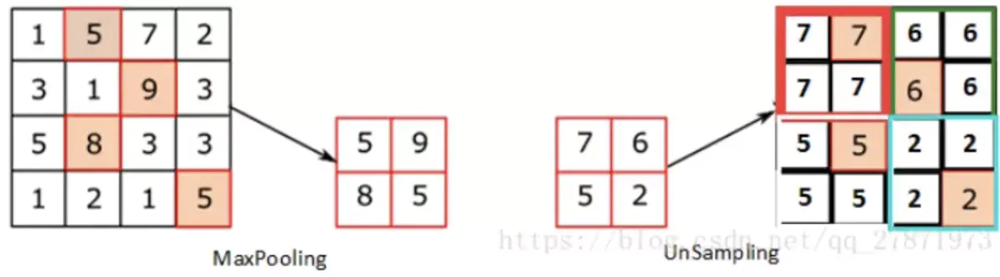
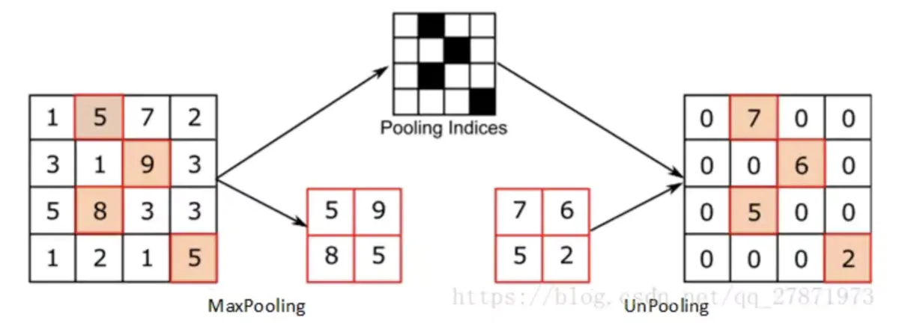

# 常用专业名词解释

[TOC]

### batch_size

 		每个批次(batch)的样本数量

### epoch

​		所有样本一共要计算epoch遍

### step即iteration

​		一个step/iteration其实指的就是一次梯度更新的过程；例如在每个epoch中有2000个用于训练的图片，我们选取了batch_size=100，那么我们就需要2000 images / 100 (images/step) = 20 steps来完成这个epoch

## 上采样方法

- U-Net在上采样使用的是转置卷积（也有人称反卷积），而FCN上采样使用的是向上池化（李沐课上讲的好像也是转置卷积）操作。

### 插值法

线性插值、二次插值等，需要经过人工挑选，不具有可学习性，效果一般

### 转置卷积

[Up-sampling with Transposed Convolution | by Naoki | Medium](https://naokishibuya.medium.com/up-sampling-with-transposed-convolution-9ae4f2df52d0)

[(翻译) 一文搞懂反卷积，转置卷积_FesianXu的博客-CSDN博客](https://blog.csdn.net/LoseInVain/article/details/81098502)

也被称作反卷积（deconvolution），但是用“转置”一词更能够表示它的涵义

**首先理解转置卷积需要引入卷积矩阵（Convolution Matrix）的概念**

> 先将卷积核进行矩阵化：
>
> 
>
> 
>
> 

> 将图像矩阵化为一个向量
>
> 

> 由此有：卷积矩阵[4, 16] * 图像矩阵[16, 1] => 结果矩阵[4, 1]
>
> 可以将结果矩阵reshape成[2, 2]，就实现了一个downsize的操作
>
> 那么反过来，是不是也可以upsize？

> 
>
> 2x2 => 16x16  --> 4x1 => 256x1  --> **[256x4]** * [4x1]
>
> 我们将卷积矩阵进行转置，再与图像矩阵相乘
>
> 转置卷积矩阵[16, 4] * 图像矩阵[4, 1] => 结果矩阵[16, 1]
>
> 将结果矩阵reshape一下就得到了upsize的图像！
>
> **但值得注意的是，上述两次操作并不是可逆关系，对于同一个卷积核（因非其稀疏矩阵不是正交矩阵），结果转置操作之后并不能恢复到原始的数值，而仅仅保留原始的形状**，所以转置卷积的名字由此而来，相比于“逆卷积”而言转置卷积更加准确。

因此一般称之为**转置卷积**！

在使用转置卷积时观察到一个棘手的现象（尤其是深色部分常出现）就是"棋盘格子状伪影"，被命名为**棋盘效应**（Checkboard artifacts）

如果将步幅设为2，在卷积核大小为2的示例中，输出上的所有像素从输入中接收相同数量的信息。由下图（a）可见，此时描以转置卷积的重叠。若将卷积核大小改为4（下图（b）），则均匀重叠区域将收缩，与此同时因为重叠是均匀的，故仍然为有效输出。

但如果将卷积核大小改为3，步长为2（下图（c）），以及将卷积核大小改为5，步长为2（下图（d）），问题就出现了，对于这两种情况输出上的每个像素接收的信息量与相邻像素不同。在输出上找不到连续且均匀重叠区域。**因此出现了规律性的格子阴影——棋盘效应**。


​	在二维情况下棋盘效应更为严重，下图直观地展示了在二维空间内的棋盘效应。


解决方法：

采取可以被步长整除的卷积核长度；

先插值，再卷积（用双线性插值初始化转置卷积权重）

> ```python
> def bilinear_kernel(in_channels, out_channels, kernel_size):
> 	factor = (kernel_size + 1) // 2
> 	if kernel_size % 2 == 1:
> 		center = factor - 1
> 	else:
> 		center = factor - 0.5
> 	og = (torch.arange(kernel_size).reshape(-1, 1),
> 		  torch.arange(kernel_size).reshape(1, -1))
> 	filt = (1 - torch.abs(og[0] - center) / factor) * \
> 		   (1 - torch.abs(og[1] - center) / factor)
> 	weight = torch.zeros((in_channels, out_channels, kernel_size, kernel_size))
> 	weight[range(in_channels), range(out_channels), :, :] = filt
> 	return weight
> conv_trans = nn.ConvTranspose2d(
> 							3, 2, kernel_size=4, padding=1, stride=2, bias=False)
> conv_trans.weight,data.copy_(bilinear_kernel(3, 3, 4))
> 
> ```

### Unsample，Unpooling





即Unsampling和UnPooling都是对Maxpooling操作的像素点对应的位置进行还原

不同在于UnSampling在其他位置采用same策略，UnPooling在其他位置采用补0

## 空洞卷积

空洞卷积（dilated convolution）是针对图像语义分割问题中下采样会降低图像分辨率、丢失信息而提出的一种卷积思路。利用添加空洞扩大感受野，让原本 3x3的卷积核，在相同参数量的情况下，用于5x5(dilated rate=2)或者更大的感受野，无须下采样。

扩张卷积（Dilated Convolution）又称空洞卷积（Atrous Convolution），向卷积层引入了一个称为 “扩张率(dilation rate)”的新参数，该参数定义了卷积核处理数据时各值的间距。换句话说，相比原来的标准卷积，扩张卷积多了一个超参数称之为dilation rate（扩张率），指的是kernel各点之间的间隔数量，正常的卷积核的扩张率为1。


上图是一个扩张率为2，**尺寸为3×3的空洞卷积，感受野与5×5的卷积核相同**，而且仅需要9个参数。你可以把它想象成一个5×5的卷积核，每隔一行或一列删除一行或一列。在相同的计算条件下，空洞卷积提供了更大的感受野。空洞卷积经常用在实时图像分割中。当网络层需要较大的感受野，但计算资源有限而无法提高卷积核数量或大小时，可以考虑空洞卷积。

我们来探究一下感受野


第一层的一个5×5大小的区域经过2次3×3的标准卷积之后，变成了一个点。也就是说从size上来讲，2层3x3卷积转换相当于1层5x5卷积。从以上图的演化也可以看出，一个5×5的卷积核是可以由2次连续的3×3的卷积代替。


但对于dilated=2，3x3 的扩张卷积核。可以看到第一层13x13的区域，经过2次3x3的扩张卷积之后，变成了一个点。即从size上来讲，连续2层的3x3空洞卷积转换相当于1层13x13卷积。


意义与问题

- 最早出现在DeeplLab系列中，作用：可以在不改变特征图尺寸的同时增大感受野，摈弃了pool的做法（丢失信息）；
- Dilation convolution(扩张卷积)的原理其实也比较简单，就是在kernel各个像素点之间加入0值像素点，变向的增大核的尺寸从而增大感受野。
- 对比**传统的conv操作，3层3x3的卷积加起来，stride为1的话，只能达到(kernel-1)*layer+1=7的感受野，也就是和层数layer成线性关系，而dilated conv的感受野是指数级的增长。**
- 扩张卷积与普通的卷积相比，除了卷积核的大小以外，还有一个扩张率(dilation rate)参数，主要用来表示扩张的大小。扩张卷积与普通卷积的相同点在于，**卷积核的大小是一样的，在神经网络中即参数数量不变，区别在于扩张卷积具有更大的感受野**。

经过dilation rate放大后，卷积核尺寸为：
$$
{d \times (k-1)+1}
$$
扩张卷积的输入和输出特征图的尺寸关系如下：(计算公式和普通卷积一样，只要用新的卷积核尺寸带入即可)
$$
{\color{Purple}W_{2} = \frac{ W_{1} + 2p +s-[d(k-1)+1]}{s}}
$$

当在**s=1,k=3时，令d = p**，则输出特征图尺寸不变；

**空洞卷积存在的问题：**


**Gridding效应**

- 局部信息丢失：由于空洞卷积的计算方式类似于棋盘格式，某一层得到的卷积结果，来自上一层的独立的集合，没有相互依赖，因此该层的卷积结果之间没有相关性，即**局部信息丢失**。

通过图a解释了空洞卷积存在的问题，三层卷积均为r=2的空洞卷积,可以看出红色像素的感受野为13。这种空洞卷积核并不连续，所以不是所有的pixel都用来计算，且参与实际计算的只有75%，损失了信息的连续性，这对像素级密集预测任务来说事不适用的。

多次叠加多个具有相同空洞率的卷积核会造成格网中有一些像素自始至终都没有参与运算，不起任何作用，这对于像素级别的预测是不友好的。

**Long-ranged information might be not relevant.**

- 远距离获取的信息没有相关性：由于空洞卷积稀疏的采样输入信号，用来获取远距离信息。但是这种信息之间没有相关性，同时当对大物体分割时，会有一定的效果，但是**对于小物体来说，有弊无利**。

我们从空洞卷积的设计背景来看就能推测出这样的设计是用来获取长距离信息。然而光采用大采样率的信息或许只对一些大物体分割有效果，而对小物体来说可能则有弊无利了。如何同时处理不同大小的物体的关系，则是设计好 dilated convolution 网络的关键。

总结：简单来说，就是空洞卷积虽然在参数不变的情况下保证了更大的感受野，但是对于一些很小的物体，本身就不要那么大的感受野来说，这是不友好的。

**图森组提出HDC的方案解决该问题。**（Hybrid Dilated Convolution）

1. 第一个特性是，叠加卷积的空洞率不能有大于1的公约数。比如 [2, 4, 6] 则不是一个好的三层卷积，依然会出现 gridding effect。
2. 第二个特性是，我们将空洞率设计成锯齿状结构，例如 [1, 2, 5, 1, 2, 5] 循环结构。

> 并且第一个必须r_1必须是1，因为由下面3.可知，有Mi >= ri，而Mi表示的是非零元素之间的最大距离，如果ri大于1了，那么说明Mi也大于1，这样利用到的像素点就有间隙了，也就是会产生棋盘效应。

3. 第三个特性是，我们需要满足一下这个式子： 

$$
M_i = max \begin{bmatrix} M_{i+1} -2r_i, \  M_{i+1} - 2(M_{i+1} - r_i), \ r_i \end{bmatrix}
$$

> 其中 r_i 是 i 层的 空洞率，而 M_i 是指在 i 层的最大空洞率（define the "maximum distance between two nonzero values"），那么假设总共有 n 层的话，默认 M_n = r_n 。假设我们应用于 kernel 为 kxk 的话，我们的目标则是 **M_2 <= k**  ，这样我们至少可以用空洞率为1，即标准卷积的方式来覆盖掉所有洞。

一个简单的例子:  dilation rate [1, 2, 5] with 3 x 3 kernel (可行的方案)


​		而这样的锯齿状本身的性质就比较好的来同时满足小物体大物体的分割要求(小 dilation rate 来关心近距离信息，大 dilation rate 来关心远距离信息)。这样我们的卷积依然是连续的也就依然能满足VGG组观察的结论，大卷积是由小卷积的 regularisation 的 叠加。以下的对比实验可以明显看出，一个良好设计的 dilated convolution 网络能够有效避免 gridding effect.


### 参考

- https://www.zhihu.com/question/54149221/answer/323880412