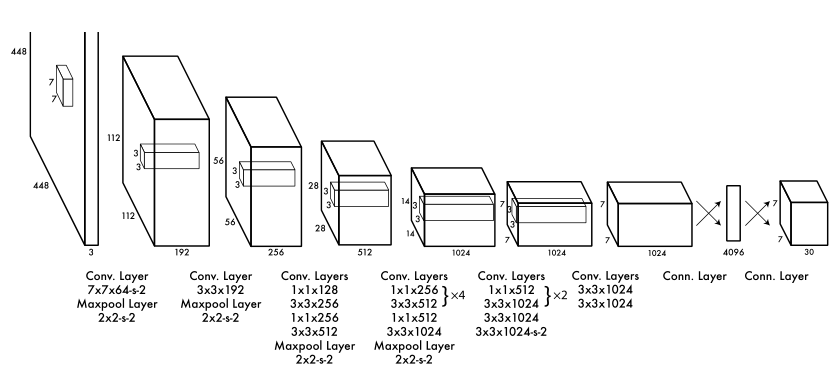
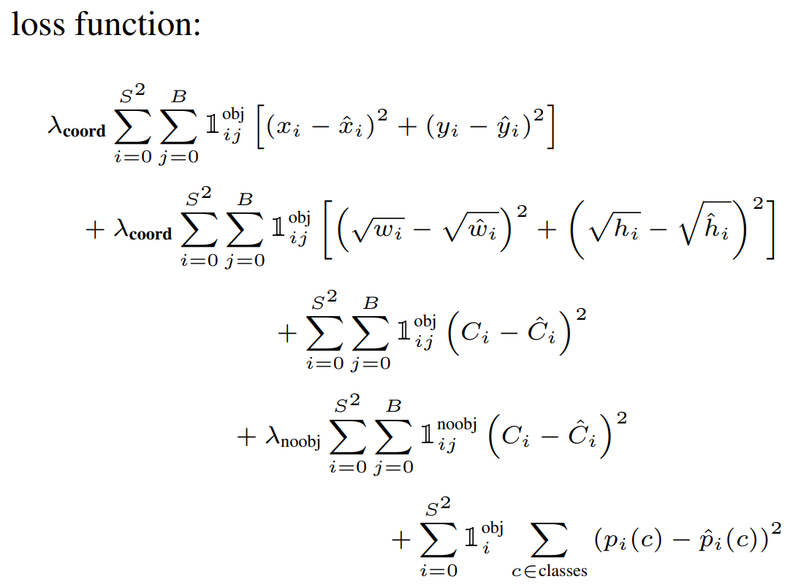

# 项目一：yolov3口罩检测

> 项目简介：
>
> 采用yolov3设计了一个口罩检测模型，通过tensorflowjs部署在了web上，体验网址：[Mask-or-Not (breezewrf.cn)](http://maskornot.breezewrf.cn/)

目标检测当前大致可以分为两个方向：

（1）**two-stage方法：**如基于Region Proposal的R-CNN系算法（R-CNN，Fast R-CNN, Faster R-CNN），它们是two-stage的，需要先使用启发式方法（selective search）或者CNN网络（RPN）产生Region Proposal，然后再在Region Proposal上做分类与回归如R-CNN系算法。其主要思路是先通过启发式方法（selective search）或者CNN网络（RPN)产生一系列稀疏的候选框，然后对这些候选框进行分类与回归，two-stage方法的优势是准确度高；

（2）**one-stage方法：**如Yolo和SSD，其主要思路是均匀地在图片的不同位置进行密集抽样，抽样时可以采用不同尺度和长宽比，然后利用CNN提取特征后直接进行分类与回归，整个过程只需要一步，所以其优势是速度快，但是均匀的密集采样的一个重要缺点是训练比较困难，这主要是因为正样本与负样本（背景）极其不均衡（参见[Focal Loss](https://link.zhihu.com/?target=https%3A//arxiv.org/abs/1708.02002)），导致模型准确度稍低

**本文将讲解的内容有：SSD，Yolo系列，R-CNN**

[TOC]

## Yolov1

You Only Look Once 

> **滑动窗口技术**：
>
> ​		概述：将检测问题转化为了图像分类问题。其基本原理就是采用不同大小和比例（宽高比）的窗口在整张图片上以一定的步长进行滑动，然后对这些窗口对应的区域做图像分类，这样就可以实现对整张图片的检测了；
>
> ​		缺点：并不知道要检测的目标大小是什么规模，所以你要设置不同大小和比例的窗口去滑动，而且还要选取合适的步长。但是这样会产生很多的子区域，并且都要经过分类器去做预测，这需要很大的计算量，所以你的分类器不能太复杂，因为要保证速度。
>
> ​		解决思路：思路之一就是减少要分类的子区域，这就是R-CNN的一个改进策略，其采用了selective search方法来找到最有可能包含目标的子区域（Region Proposal），其实可以看成采用启发式方法过滤掉很多子区域，这会提升效率。

#### 0、Unified Detection

​		yolo的CNN网络将输入图片分割为**S x S**网络，然后每个单元格（grid cell）负责去检测那些中心点在单元格中的目标；每个单元格会预测**B**个边界框（bounding box）以及边界框的置信度（confidence score）

**置信度**可以定义为`confidece = Pr(object) * IOU`，当bounding box不包括目标时（是背景）Pr = 0，包含目标时Pr = 1，IOU是预测框(predict bounding box)与实际框(ground truth)的IOU

**边界框**的预测包括**5**个预测值：(x, y, w, h, c)，其中x，y是边界框中心相对左上角坐标的偏移值，单位是相对于单元格大小，w和h是相对于整个图片高宽的比例（**归一化**），c是置信度，每个单元格还要给出**C**个类别的概率值，**注意：不管一个单元格预测多少个边界框B，每个单元格都只预测 同一组 类别概率值**

可以把yolo看作回归模型，所有的预测值可以编码为一个张量：`S x S x (B*5 + C)`，在Pascal VOC数据集中，使用S = 7，B = 2，由于Pascal VOC有20个类，故C = 20，因此最后的预测是一个   `7 x 7 x 30` 的张量。

#### 1、Network Design

24个Conv + 2个全连接(1x1Conv)

最后一层使用线性激活函数，其余所有层使用leaky Relu

上图tensor对应class=20，两个bounding box，每个有五个predict value。对于边界框为什么把置信度 ![[公式]](https://www.zhihu.com/equation?tex=c) 和 ![[公式]](https://www.zhihu.com/equation?tex=%28x%2C+y%2Cw%2Ch%29) 都分开排列，而不是按照 ![[公式]](https://www.zhihu.com/equation?tex=%28x%2C+y%2Cw%2Ch%2Cc%29) 这样排列，其实纯粹是为了计算方便。

**SSE(sum-squared error)误差平方和**

(MSE是均方差)

​		使用和方误差是因为它很容易优化，

​		但是它并不完全符合我们最大化平均精度的目标。它将定位误差与分类误差同等加权，而分类误差可能并不理想。此外，在每个图像中，许多网格单元格不包含任何对象。这将这些单元格的confidence推向0，通常会压倒包含对象的单元格的梯度。这可能会导致模型不稳定，导致训练在早期出现偏差

​		为了弥补这一点，yolo**增加了边界框坐标预测的损失（乘上5），并减少了不包含对象的框的置信度预测的损失（乘上0.5）。**

​		同时SSE也同等看待large boxes和small boxes的误差，但实际上我们需要是误差度量反映出large boxes 的小误差比small boxes的小误差更重要，即同等对待大小不同的边界框，但是实际上较小的边界框的坐标误差应当要比较大的边界框要更敏感。为了保证这一点，将网络的边界框的宽与高预测改为对其平方根的预测，即预测值变为 ![[公式]](C:%5CUsers%5CBreeze%5CDesktop%5Cgra_proj%5Cgraduation_project%5Cdive-into-dl-pytorch-notes%5Cimages%5Cequation.svg) 。

​		但是对于宽高为什么用了平方根呢？这里是这样的，我们先来看下图：

​		上图中，蓝色为bounding box，红色框为真实标注，如果W和h没有平方根的话，那么bounding box跟两个真实标注的位置loss是相同的。但是从面积看来B框是A框的25倍，C框是B框的81/25倍。B框跟A框的大小偏差更大，所以不应该有相同的loss。

​		因此yolo**预测边界框高度和宽度的平方根而不是直接预测高宽。**

​		**减少过拟合：**dropout，随即缩放、平移，随机曝光、饱和度

#### 2、Loss

​		由于每个单元格预测多个边界框。但是其对应类别只有一个。那么在训练时，如果该单元格内确实存在目标，那么只选择与ground truth的IOU最大的那个边界框来负责预测该目标，而其它边界框认为不存在目标。要注意的一点时，**对于不存在对应目标的边界框，其误差项就是只有置信度，坐标项误差是没法计算的。而只有当一个单元格内确实存在目标时，才计算分类误差项，否则该项也是无法计算的。**

loss中包含了坐标误差、置信度误差(noobj表示box中不包含目标)

#### 3、NMS

非极大值抑制算法（non maximum suppression, NMS）

通常在检测算法中会用到，可以解决“一个目标被多次检测的问题”。

算法：首先从所有的检测框（A>B>C>D>E>F，通常会先用一个threshold过滤一些置信度过小的框）中找到置信度最大的那个框A，然后挨个计算其与剩余框的IOU，如果其值(A-IOU-D、A-IOU-F)大于一定阈值（重合度过高），那么就将该框(D、F)剔除，标记第一个框A；然后对剩余的检测框重复上述过程，直到处理完所有的检测框（选出置信度最大的B，计算C、D与B的IOU）。

#### 4、Limitation

​		1、Yolo对bounding box的预测施加了很强的空间约束，由于一个grid cell只能由两个bounding box，但在训练时，yolo只指定其中一个具有最大IOU的predictor负责预测某对象，即只能有一个class。这使得bounding box predictors之间具有专门化，对于不同尺寸、横纵比的物体有对应不同的predictor。但也**限制了模型可以预测的附近物体的数量**。我们的模型很难处理成群出现的小对象，比如鸟群。因为我们的模型学会了从数据中预测边界框，所以它很难推广到新的或不寻常的纵横比或配置的对象。

​		2、large box的小错误实际上可以忽略，但small box里的小错误实际上确实影响很大（因为要算IOU），即使采用了平方根也不能完全解决这个问题。

* 每个网格只对应两个bounding box，当物体的**长宽比不常见**(也就是训练数据集覆盖不到时)，效果较差。
* 原始图片只划分为7x7的网格，当**两个物体靠的很近**时，效果比较差。
* 最终**每个网格只对应一个类别，容易出现漏检**(物体没有被识别到)。
* 对于图片中**比较小的物体**，效果比较差。这其实是所有目标检测算法的通病。

#### 5、改进

​		参考SSD采用多尺度单元格；Faster R-CNN采用anchor boxes

## Yolov2

**darknet19**，包括9个卷积层和5个maxpooling层，与VGG16模型相似，主要采用 ![[公式]](C:%5CUsers%5CBreeze%5CDesktop%5Cgra_proj%5Cgraduation_project%5Cdive-into-dl-pytorch-notes%5Cimages%5Cequation-1645342361076.svg) 卷积，采用 ![[公式]](C:%5CUsers%5CBreeze%5CDesktop%5Cgra_proj%5Cgraduation_project%5Cdive-into-dl-pytorch-notes%5Cimages%5Cequation-1645342361068.svg) 的maxpooling层之后，特征图维度降低2倍，而同时将特征图的channles增加两倍，与NiN相似，最终采用global avgpooling做预测，并且在 ![[公式]](C:%5CUsers%5CBreeze%5CDesktop%5Cgra_proj%5Cgraduation_project%5Cdive-into-dl-pytorch-notes%5Cimages%5Cequation-1645342398743.svg) 卷积之间使用 ![[公式]](C:%5CUsers%5CBreeze%5CDesktop%5Cgra_proj%5Cgraduation_project%5Cdive-into-dl-pytorch-notes%5Cimages%5Cequation-1645342398732.svg) 卷积来压缩特征图channles以降低模型计算量和参数。

1、使用BN代替dropout

2、训练时加入高分辨率图像：分辨率较低会影响检测效果，因此yolov1时在预测时将图像放大至448x448，但训练时仍使用224x224，这实际上并不合适，因此yolov2在训练中增加了448x448的输入来finetune 10个epochs

3、Anchor boxes

由于yolov1采用全连接层直接对边界框进行预测，不同尺度和高宽比导致定位效果差，**v2借鉴了faster R-CNN中RPN网络的先验框（anchor boxes，prior boxes）**。使用了anchor boxes之后，每个位置的各个anchor box都单独预测一套分类概率值，v1只能预测98个边界框（`7*7*2`）,v2可以预测上千个边界框（`13*13*num_anchors`）使得可以结果是召回率大大提升。

4、dimens cluster

Faster R-CNN和SSD中，先验框的维度（长和宽）都是手动设定的，带有一定的主观性。YOLOv2采用**k-means聚类**方法对训练集中的边界框做了聚类分析。因为设置先验框的主要目的是为了使得预测框与ground truth的IOU更好，所以聚类分析时选用box与聚类中心box之间的IOU值作为距离指标：![[公式]](C:%5CUsers%5CBreeze%5CDesktop%5Cgra_proj%5Cgraduation_project%5Cdive-into-dl-pytorch-notes%5Cimages%5Cequation-1645328092833.svg)

5、direct location prediction

没有使用RPN网络计算location，因为其没有进行归一化，数值不稳定，yolov2沿用了v1的方法用sigmoid处理偏移值

6、Fine-Gained Features

针对小物体的检测，13x13的特征图仍然不够。SSD提出多尺度特征图来检测不同大小的物体，yolov2则提出一种passthrough层来利用更精细的特征图。passthrough将最后一个maxpooling的输入26x26x512特征图通过**类似residual**的方式连接到后面低分辨率13x13的特征图上。前面的特征图维度是后面的特征图的2倍，passthrough层抽取前面层的每个 ![[公式]](C:%5CUsers%5CBreeze%5CDesktop%5Cgra_proj%5Cgraduation_project%5Cdive-into-dl-pytorch-notes%5Cimages%5Cequation-1645341799346.svg) 的局部区域，然后将其转化为channel维度，对于 ![[公式]](C:%5CUsers%5CBreeze%5CDesktop%5Cgra_proj%5Cgraduation_project%5Cdive-into-dl-pytorch-notes%5Cimages%5Cequation-1645341799385.svg) 的特征图，经passthrough层处理之后就变成了 ![[公式]](C:%5CUsers%5CBreeze%5CDesktop%5Cgra_proj%5Cgraduation_project%5Cdive-into-dl-pytorch-notes%5Cimages%5Cequation-1645341799380.svg) 的新特征图（特征图大小降低4倍，而channles增加4倍），这样就可以与后面的 ![[公式]](C:%5CUsers%5CBreeze%5CDesktop%5Cgra_proj%5Cgraduation_project%5Cdive-into-dl-pytorch-notes%5Cimages%5Cequation-1645341799368.svg) 特征图连接在一起形成 ![[公式]](C:%5CUsers%5CBreeze%5CDesktop%5Cgra_proj%5Cgraduation_project%5Cdive-into-dl-pytorch-notes%5Cimages%5Cequation-1645341799369.svg) 大小的特征图，然后在此特征图基础上卷积做预测。

7、Multi-Scale Training

**由于模型中只有卷积层和池化层，可以采用多尺度图像训练**，由于下采样总步长为32，因此输入图像尺寸应当是32整数倍的值{320，352，...，608}

#### yolo9000

​		是在YOLOv2的基础上提出的一种可以检测超过9000个类别的模型，其主要贡献点在于提出了一种**分类和检测的联合训练**策略。	

​		众多周知，检测数据集的标注要比分类数据集打标签繁琐的多，所以ImageNet分类数据集比VOC等检测数据集高出几个数量级。在YOLO中，**边界框的预测其实并不依赖于物体的标签（一组中的5个变量独立输出），所以YOLO可以实现在分类和检测数据集上的联合训练**。对于检测数据集，可以用来学习预测物体的边界框、置信度以及为物体分类，而对于分类数据集可以仅用来学习分类，但是其可以大大扩充模型所能检测的物体种类。

​		作者选择在COCO和ImageNet数据集上进行联合训练，但是遇到的第一问题是两者的类别并不是完全互斥的，比如"Norfolk terrier"明显属于"dog"，所以作者提出了一种**层级分类方法**（Hierarchical classification），主要思路是根据各个类别之间的从属关系（根据WordNet）建立一种树结构**WordTree**。

## Yolov3

**darknet53**，采用了残差结构和FPN（特征金字塔，不是RPN）架构

有了residual可以使得网络变得更深（包含53个卷积层）

FPN架构实现多尺度检测（特征金字塔）
